# 🦜🔗 LangChain for Absolute Beginners
### A Complete Guide with Code Examples, Diagrams & Infographics

> **Using Groq LLM & Google Gemini as LLM Providers**  
> Python-focused | Beginner-friendly | 20+ Concepts Explained

---

## 📌 Table of Contents

| # | Concept | Level |
|---|---------|-------|
| 1 | [What is LangChain?](#1-what-is-langchain) | 🟢 Beginner |
| 2 | [Setting Up Your Environment](#2-setting-up-your-environment) | 🟢 Beginner |
| 3 | [LLMs — The Core Engine](#3-llms--the-core-engine) | 🟢 Beginner |
| 4 | [Prompt Templates](#4-prompt-templates) | 🟢 Beginner |
| 5 | [Chains — Linking Steps Together](#5-chains--linking-steps-together) | 🟢 Beginner |
| 6 | [Chat Models](#6-chat-models) | 🟢 Beginner |
| 7 | [Messages — HumanMessage, AIMessage, SystemMessage](#7-messages) | 🟢 Beginner |
| 8 | [Output Parsers](#8-output-parsers) | 🟡 Intermediate |
| 9 | [Memory — Making AI Remember](#9-memory) | 🟡 Intermediate |
| 10 | [Document Loaders](#10-document-loaders) | 🟡 Intermediate |
| 11 | [Text Splitters](#11-text-splitters) | 🟡 Intermediate |
| 12 | [Embeddings](#12-embeddings) | 🟡 Intermediate |
| 13 | [Vector Stores](#13-vector-stores) | 🟡 Intermediate |
| 14 | [Retrievers](#14-retrievers) | 🟡 Intermediate |
| 15 | [RAG — Retrieval Augmented Generation](#15-rag--retrieval-augmented-generation) | 🟡 Intermediate |
| 16 | [Agents](#16-agents) | 🔴 Advanced |
| 17 | [Tools](#17-tools) | 🔴 Advanced |
| 18 | [LangChain Expression Language (LCEL)](#18-lcel--langchain-expression-language) | 🟡 Intermediate |
| 19 | [Callbacks & Streaming](#19-callbacks--streaming) | 🟡 Intermediate |
| 20 | [Structured Output](#20-structured-output) | 🟡 Intermediate |
| 21 | [Few-Shot Prompting](#21-few-shot-prompting) | 🟢 Beginner |
| 22 | [Conversation Chains](#22-conversation-chains) | 🟡 Intermediate |
| 23 | [Multi-Chain Pipelines](#23-multi-chain-pipelines) | 🔴 Advanced |
| 24 | [LangSmith — Debugging & Observability](#24-langsmith--debugging--observability) | 🟡 Intermediate |
| 25 | [Building a Complete App](#25-building-a-complete-app) | 🔴 Advanced |

---

## 🗺️ LangChain Big Picture

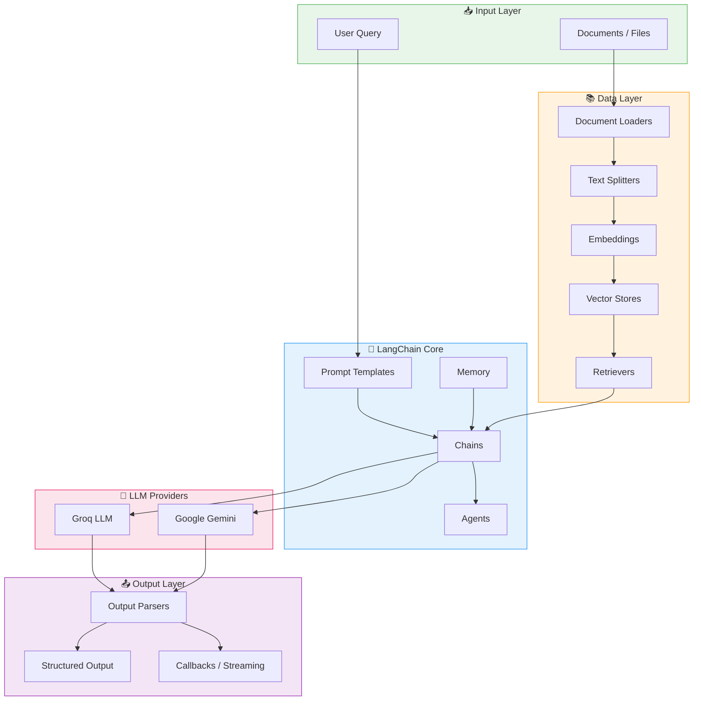

---

## 1. What is LangChain?

### 📖 Explanation

LangChain is a **framework for building applications powered by Large Language Models (LLMs)**. Think of it as a toolkit that helps you:

- Connect AI models to your data
- Build multi-step AI workflows
- Create AI agents that can use tools
- Add memory to AI conversations

**Analogy:** LangChain is like LEGO blocks for AI — each piece (prompt, model, memory, tool) snaps together to build powerful applications.

### 🏗️ What Problems Does LangChain Solve?

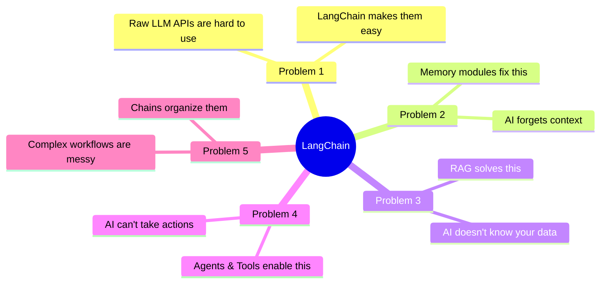

### 🔑 Key Components at a Glance

| Component | What it does | Analogy |
|-----------|-------------|---------|
| **LLM / Chat Model** | The AI brain | The chef |
| **Prompt Template** | Instructions for the AI | The recipe |
| **Chain** | Sequence of steps | Assembly line |
| **Memory** | Remembers conversation | Notepad |
| **Agent** | AI that makes decisions | Manager |
| **Tool** | Action the AI can take | Chef's knife |
| **Retriever** | Finds relevant info | Research assistant |
| **Vector Store** | Stores knowledge | Library |

---

## 2. Setting Up Your Environment

### 📖 Explanation

Before writing code, you need to install the required libraries and set up API keys for your chosen LLM providers.

### 📦 Installation

```bash
# Install core LangChain
pip install langchain langchain-core langchain-community

# For Groq
pip install langchain-groq

# For Google Gemini
pip install langchain-google-genai

# Useful extras
pip install python-dotenv chromadb faiss-cpu
```

### 🔑 API Keys Setup

Create a `.env` file in your project folder:

```env
# .env file
GROQ_API_KEY=your_groq_api_key_here
GOOGLE_API_KEY=your_google_api_key_here
```

> **Get your keys:**
> - Groq: https://console.groq.com → Free tier available!
> - Google Gemini: https://aistudio.google.com → Free tier available!

### 🐍 Load Environment Variables

```python
# setup.py
from dotenv import load_dotenv
import os

# Load keys from .env file
load_dotenv()

GROQ_API_KEY = os.getenv("GROQ_API_KEY")
GOOGLE_API_KEY = os.getenv("GOOGLE_API_KEY")

print("✅ Environment loaded successfully!")
```

### 📁 Recommended Project Structure

```
my_langchain_app/
├── .env                  # API keys (never commit this!)
├── .gitignore            # Add .env here
├── requirements.txt      # Dependencies
├── main.py               # Main application
├── chains/               # Custom chains
├── prompts/              # Prompt templates
└── data/                 # Your documents
```

---

## 3. LLMs — The Core Engine

### 📖 Explanation

An **LLM (Large Language Model)** is the AI brain of your application. LangChain wraps different LLM providers so you can use them with the same interface. Think of it like a universal remote — same buttons, different TV brands.

### 🔄 How LLMs Work in LangChain

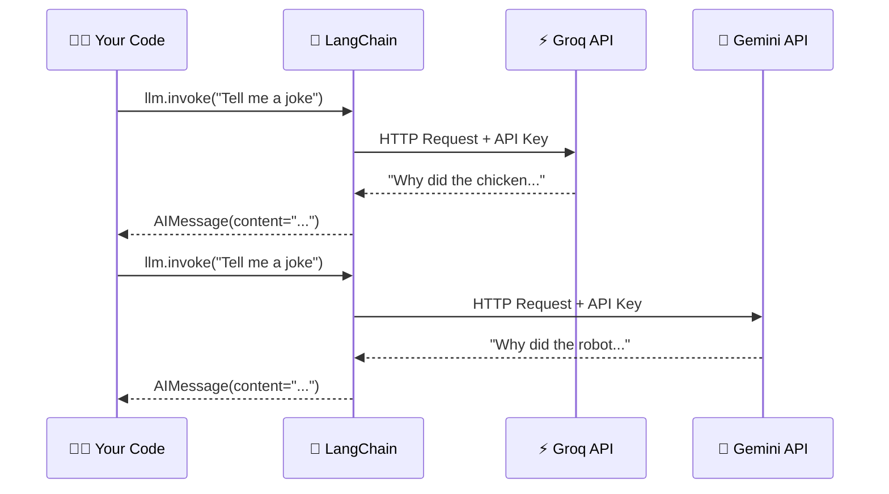

### 💻 Code Example — Groq LLM

```python
# groq_llm_basic.py
from langchain_groq import ChatGroq
from dotenv import load_dotenv

load_dotenv()

# Initialize Groq LLM
llm = ChatGroq(
    model="llama3-8b-8192",   # Fast & free model
    temperature=0.7,           # 0 = deterministic, 1 = creative
    max_tokens=500
)

# Simple invocation
response = llm.invoke("What is artificial intelligence? Explain in 2 sentences.")

print(response.content)
# Output: Artificial intelligence (AI) is the simulation of human...
```

### 💻 Code Example — Google Gemini LLM

```python
# gemini_llm_basic.py
from langchain_google_genai import ChatGoogleGenerativeAI
from dotenv import load_dotenv

load_dotenv()

# Initialize Gemini LLM
llm = ChatGoogleGenerativeAI(
    model="gemini-1.5-flash",   # Fast & free model
    temperature=0.7,
    max_output_tokens=500
)

# Simple invocation
response = llm.invoke("What is artificial intelligence? Explain in 2 sentences.")

print(response.content)
```

### 🎛️ Popular Model Options

| Provider | Model Name | Speed | Best For |
|----------|-----------|-------|---------|
| **Groq** | `llama3-8b-8192` | ⚡ Ultra Fast | Quick tasks |
| **Groq** | `llama3-70b-8192` | ⚡ Fast | Complex reasoning |
| **Groq** | `mixtral-8x7b-32768` | ⚡ Fast | Long contexts |
| **Gemini** | `gemini-1.5-flash` | 🚀 Fast | General use |
| **Gemini** | `gemini-1.5-pro` | 🐢 Slower | Complex tasks |
| **Gemini** | `gemini-2.0-flash` | ⚡ Fast | Latest model |

### 🌡️ Temperature Guide

```
Temperature = 0.0  →  Very predictable, same answer every time
Temperature = 0.3  →  Slightly varied, good for factual tasks
Temperature = 0.7  →  Balanced creativity (recommended)
Temperature = 1.0  →  Very creative, unpredictable
Temperature = 2.0  →  Wild & random (usually too much!)
```

---

## 4. Prompt Templates

### 📖 Explanation

A **Prompt Template** is a reusable template with variables that get filled in dynamically. Instead of writing a full prompt every time, you create a template once and fill in the blanks.

**Analogy:** Like a Mad Libs book — the structure is fixed, but you fill in the words!

### 🔧 How Prompt Templates Work

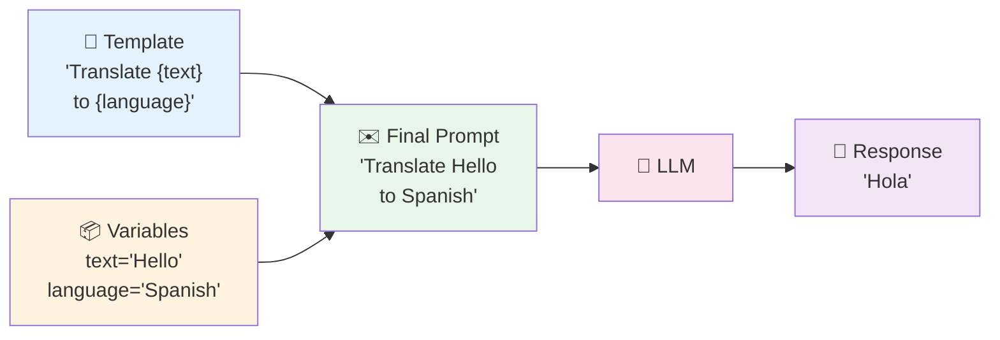

### 💻 Code Example — Groq with Prompt Template

```python
# prompt_template_groq.py
from langchain_groq import ChatGroq
from langchain_core.prompts import PromptTemplate
from dotenv import load_dotenv

load_dotenv()

llm = ChatGroq(model="llama3-8b-8192", temperature=0.7)

# Create a template with variables in curly braces
template = PromptTemplate(
    input_variables=["topic", "level"],
    template="""
    Explain {topic} to a {level} student.
    Use simple language and one real-world example.
    Keep it under 100 words.
    """
)

# Fill in the template
filled_prompt = template.format(topic="neural networks", level="high school")
print("📝 Generated Prompt:")
print(filled_prompt)

# Send to LLM
response = llm.invoke(filled_prompt)
print("\n🤖 LLM Response:")
print(response.content)
```

### 💻 Code Example — Gemini with ChatPromptTemplate

```python
# chat_prompt_gemini.py
from langchain_google_genai import ChatGoogleGenerativeAI
from langchain_core.prompts import ChatPromptTemplate
from dotenv import load_dotenv

load_dotenv()

llm = ChatGoogleGenerativeAI(model="gemini-1.5-flash", temperature=0.5)

# ChatPromptTemplate is for chat-style conversations
chat_prompt = ChatPromptTemplate.from_messages([
    ("system", "You are a helpful {role} named {name}."),
    ("human", "{user_question}")
])

# Format the template
messages = chat_prompt.format_messages(
    role="coding assistant",
    name="PyHelper",
    user_question="How do I reverse a list in Python?"
)

print("📝 Formatted Messages:")
for msg in messages:
    print(f"  [{msg.type}]: {msg.content[:50]}...")

# Get response
response = llm.invoke(messages)
print(f"\n🤖 Response: {response.content}")
```

### 🎯 Types of Prompt Templates

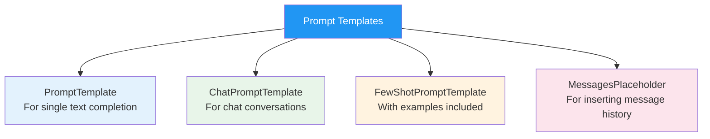

---

## 5. Chains — Linking Steps Together

### 📖 Explanation

A **Chain** connects multiple components together in a sequence. Output from one step becomes input for the next. This is how you build complex AI workflows from simple building blocks.

**Analogy:** An assembly line where each station does one job before passing the product to the next.

### 🔗 Chain Flow

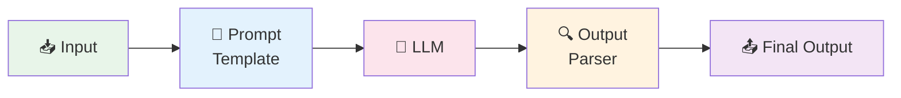

### 💻 Code Example — Simple Chain with Groq (LCEL Style)

```python
# simple_chain_groq.py
from langchain_groq import ChatGroq
from langchain_core.prompts import ChatPromptTemplate
from langchain_core.output_parsers import StrOutputParser
from dotenv import load_dotenv

load_dotenv()

llm = ChatGroq(model="llama3-8b-8192", temperature=0.7)

# Step 1: Create prompt
prompt = ChatPromptTemplate.from_template(
    "Write a short poem about {topic} in exactly 4 lines."
)

# Step 2: Create output parser
output_parser = StrOutputParser()

# Step 3: Chain them with the pipe operator |
chain = prompt | llm | output_parser

# Step 4: Run the chain
result = chain.invoke({"topic": "Python programming"})
print("🎵 Generated Poem:")
print(result)
```

### 💻 Code Example — Sequential Chain with Gemini

```python
# sequential_chain_gemini.py
from langchain_google_genai import ChatGoogleGenerativeAI
from langchain_core.prompts import ChatPromptTemplate
from langchain_core.output_parsers import StrOutputParser
from dotenv import load_dotenv

load_dotenv()

llm = ChatGoogleGenerativeAI(model="gemini-1.5-flash", temperature=0.7)

# Chain 1: Generate a business idea
idea_prompt = ChatPromptTemplate.from_template(
    "Generate ONE innovative business idea in the {industry} industry. Just the idea, no details."
)
idea_chain = idea_prompt | llm | StrOutputParser()

# Chain 2: Expand that idea
expand_prompt = ChatPromptTemplate.from_template(
    "Expand on this business idea: {idea}\nProvide: Target market, Revenue model, Key challenge."
)
expand_chain = expand_prompt | llm | StrOutputParser()

# Combine: output of chain 1 → input of chain 2
def run_sequential(industry):
    idea = idea_chain.invoke({"industry": industry})
    print(f"💡 Idea: {idea}\n")
    
    full_plan = expand_chain.invoke({"idea": idea})
    print(f"📋 Business Plan:\n{full_plan}")

run_sequential("sustainable fashion")
```

---

## 6. Chat Models

### 📖 Explanation

**Chat Models** are LLMs specifically designed for conversation. Unlike simple LLMs that take raw text, Chat Models understand structured conversations with roles like **System**, **Human**, and **AI**.

### 🎭 Chat Model Roles

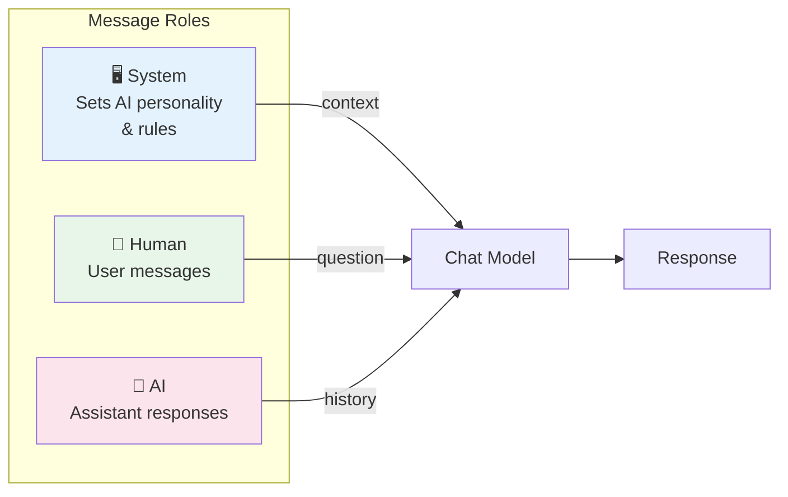

### 💻 Code Example — Chat Model with Groq

```python
# chat_model_groq.py
from langchain_groq import ChatGroq
from langchain_core.messages import SystemMessage, HumanMessage, AIMessage
from dotenv import load_dotenv

load_dotenv()

chat = ChatGroq(model="llama3-70b-8192", temperature=0.5)

# Build a conversation
messages = [
    SystemMessage(content="You are a friendly Python tutor. Keep explanations short and clear."),
    HumanMessage(content="What is a list in Python?"),
    AIMessage(content="A list is an ordered, mutable collection. Example: fruits = ['apple', 'banana', 'cherry']"),
    HumanMessage(content="How do I add an item to it?")  # Follow-up question
]

# The model sees the FULL conversation history
response = chat.invoke(messages)
print("🤖 Tutor Response:")
print(response.content)
```

### 💻 Code Example — Chat Model with Gemini

```python
# chat_model_gemini.py
from langchain_google_genai import ChatGoogleGenerativeAI
from langchain_core.messages import SystemMessage, HumanMessage
from dotenv import load_dotenv

load_dotenv()

chat = ChatGoogleGenerativeAI(model="gemini-1.5-flash", temperature=0.3)

# Multi-turn conversation
messages = [
    SystemMessage(content="You are a helpful nutritionist. Give concise, practical advice."),
    HumanMessage(content="What should I eat for breakfast to boost my energy?")
]

response = chat.invoke(messages)
print(f"🥗 Nutritionist: {response.content}")

# Add the response and ask a follow-up
messages.append(response)
messages.append(HumanMessage(content="What if I'm lactose intolerant?"))

response2 = chat.invoke(messages)
print(f"\n🥗 Nutritionist (follow-up): {response2.content}")
```

---

## 7. Messages

### 📖 Explanation

**Messages** are the structured way LangChain passes information to chat models. Each message has a **role** (who's speaking) and **content** (what they're saying).

### 📨 Message Types

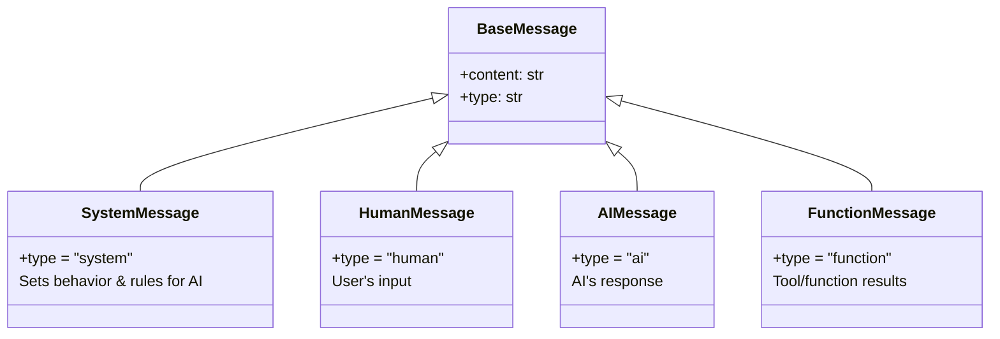

### 💻 Code Example — All Message Types with Groq

```python
# messages_groq.py
from langchain_groq import ChatGroq
from langchain_core.messages import (
    SystemMessage,
    HumanMessage,
    AIMessage
)
from dotenv import load_dotenv

load_dotenv()

llm = ChatGroq(model="llama3-8b-8192", temperature=0.5)

# Creating each message type
system_msg = SystemMessage(content="You are a witty science explainer.")
human_msg = HumanMessage(content="Why is the sky blue?")
ai_msg = AIMessage(content="Because of Rayleigh scattering! Short blue wavelengths scatter more.")

# Print message details
for msg in [system_msg, human_msg, ai_msg]:
    print(f"Type: {msg.type:10} | Content: {msg.content[:50]}")

# Use messages in a conversation
conversation = [system_msg, human_msg]
response = llm.invoke(conversation)
print(f"\n🤖 AI Response: {response.content}")
print(f"Response type: {response.type}")  # 'ai'
```

### 💻 Code Example — Dynamic Conversation Builder with Gemini

```python
# dynamic_conversation_gemini.py
from langchain_google_genai import ChatGoogleGenerativeAI
from langchain_core.messages import SystemMessage, HumanMessage, AIMessage
from dotenv import load_dotenv

load_dotenv()

llm = ChatGoogleGenerativeAI(model="gemini-1.5-flash", temperature=0.7)

class SimpleConversation:
    """A simple conversation manager"""
    
    def __init__(self, system_prompt: str):
        self.messages = [SystemMessage(content=system_prompt)]
    
    def chat(self, user_input: str) -> str:
        # Add user message
        self.messages.append(HumanMessage(content=user_input))
        
        # Get AI response
        response = llm.invoke(self.messages)
        
        # Store AI response in history
        self.messages.append(response)
        
        return response.content

# Use the conversation manager
conv = SimpleConversation("You are a helpful travel guide for Italy.")
print(conv.chat("What should I see in Rome?"))
print("\n---\n")
print(conv.chat("How many days should I spend there?"))
```

---

## 8. Output Parsers

### 📖 Explanation

LLMs return raw text. **Output Parsers** transform that raw text into structured Python objects like strings, lists, or dictionaries. This makes the output usable in your code.

### 🔄 Output Parser Flow

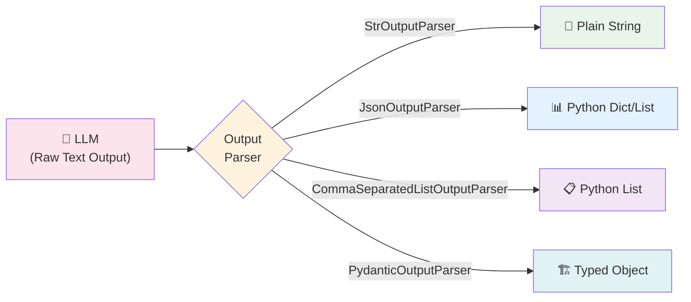

### 💻 Code Example — Multiple Parsers with Groq

```python
# output_parsers_groq.py
from langchain_groq import ChatGroq
from langchain_core.prompts import ChatPromptTemplate
from langchain_core.output_parsers import (
    StrOutputParser,
    CommaSeparatedListOutputParser
)
from langchain_core.output_parsers import JsonOutputParser
from dotenv import load_dotenv

load_dotenv()

llm = ChatGroq(model="llama3-8b-8192", temperature=0.3)

# --- 1. String Parser (default) ---
str_parser = StrOutputParser()
str_chain = ChatPromptTemplate.from_template("Say hello in {language}") | llm | str_parser
result = str_chain.invoke({"language": "French"})
print(f"String result: {result!r}")
print(f"Type: {type(result)}\n")

# --- 2. Comma Separated List Parser ---
list_parser = CommaSeparatedListOutputParser()
list_prompt = ChatPromptTemplate.from_template(
    "List 5 {category}. Respond with ONLY comma-separated values, no numbering."
)
list_chain = list_prompt | llm | list_parser
result = list_chain.invoke({"category": "programming languages"})
print(f"List result: {result}")
print(f"Type: {type(result)}, Length: {len(result)}\n")

# --- 3. JSON Parser ---
json_parser = JsonOutputParser()
json_prompt = ChatPromptTemplate.from_template(
    """Return info about {animal} as valid JSON with keys: name, habitat, diet, lifespan.
    Return ONLY the JSON object, no other text."""
)
json_chain = json_prompt | llm | json_parser
result = json_chain.invoke({"animal": "elephant"})
print(f"JSON result: {result}")
print(f"Name: {result['name']}, Habitat: {result['habitat']}")
```

### 💻 Code Example — Pydantic Parser with Gemini

```python
# pydantic_parser_gemini.py
from langchain_google_genai import ChatGoogleGenerativeAI
from langchain_core.prompts import ChatPromptTemplate
from langchain_core.output_parsers import PydanticOutputParser
from pydantic import BaseModel, Field
from typing import List
from dotenv import load_dotenv

load_dotenv()

llm = ChatGoogleGenerativeAI(model="gemini-1.5-flash", temperature=0.3)

# Define the structure we want
class MovieReview(BaseModel):
    title: str = Field(description="Movie title")
    rating: float = Field(description="Rating from 1-10")
    pros: List[str] = Field(description="List of positive aspects")
    cons: List[str] = Field(description="List of negative aspects")
    summary: str = Field(description="One sentence summary")

# Create parser
parser = PydanticOutputParser(pydantic_object=MovieReview)

# Build prompt with format instructions
prompt = ChatPromptTemplate.from_template(
    """Write a movie review for: {movie_name}
    
    {format_instructions}
    """
)

# Create chain
chain = prompt | llm | parser

# Get structured output
review = chain.invoke({
    "movie_name": "The Matrix",
    "format_instructions": parser.get_format_instructions()
})

print(f"🎬 Title: {review.title}")
print(f"⭐ Rating: {review.rating}/10")
print(f"✅ Pros: {review.pros}")
print(f"❌ Cons: {review.cons}")
print(f"📝 Summary: {review.summary}")
```

---

## 9. Memory

### 📖 Explanation

By default, LLMs have **no memory** — every conversation starts fresh. LangChain's **Memory** modules save conversation history so the AI can remember what was said earlier.

**Analogy:** Without memory, the AI is like someone with amnesia who forgets you every 5 minutes. Memory gives it a notepad!

### 🧠 Memory Types

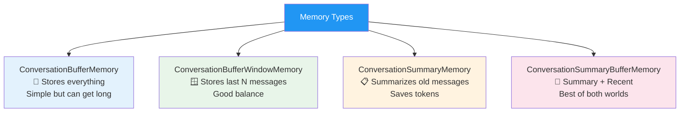

### 💻 Code Example — Conversation Memory with Groq

```python
# memory_groq.py
from langchain_groq import ChatGroq
from langchain.memory import ConversationBufferMemory
from langchain.chains import ConversationChain
from dotenv import load_dotenv

load_dotenv()

llm = ChatGroq(model="llama3-8b-8192", temperature=0.7)

# Create memory
memory = ConversationBufferMemory()

# Create conversation chain with memory
conversation = ConversationChain(
    llm=llm,
    memory=memory,
    verbose=False  # Set True to see the full prompt
)

# Chat — AI will remember context!
print("Chat 1:", conversation.predict(input="Hi! My name is Alice and I love astronomy."))
print("\nChat 2:", conversation.predict(input="What's my hobby?"))  # It remembers!
print("\nChat 3:", conversation.predict(input="Tell me something cool related to my hobby."))

# See what's stored in memory
print("\n📝 Memory contents:")
print(memory.buffer)
```

### 💻 Code Example — Window Memory with Gemini

```python
# window_memory_gemini.py
from langchain_google_genai import ChatGoogleGenerativeAI
from langchain.memory import ConversationBufferWindowMemory
from langchain.chains import ConversationChain
from dotenv import load_dotenv

load_dotenv()

llm = ChatGoogleGenerativeAI(model="gemini-1.5-flash", temperature=0.5)

# Only remember last 3 exchanges (k=3)
memory = ConversationBufferWindowMemory(k=3)

conversation = ConversationChain(llm=llm, memory=memory, verbose=False)

# Have a long conversation
topics = ["Python", "JavaScript", "Rust", "Go", "TypeScript"]
for i, topic in enumerate(topics, 1):
    response = conversation.predict(input=f"Tell me one thing about {topic}.")
    print(f"Turn {i} ({topic}): {response[:80]}...")

print(f"\n📊 Messages in memory: {len(memory.chat_memory.messages)}")
# Only last 6 messages (3 exchanges × 2 messages each)
```

---

## 10. Document Loaders

### 📖 Explanation

**Document Loaders** import data from various sources (PDF files, web pages, databases, etc.) into LangChain's standard `Document` format so you can process it with LLMs.

### 📂 Document Loader Ecosystem

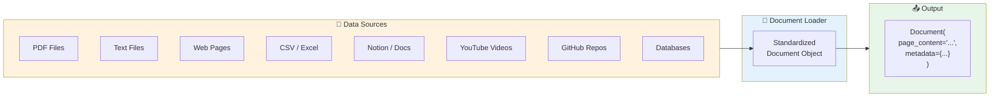

### 💻 Code Example — Multiple Loaders with Groq

```python
# document_loaders_groq.py
from langchain_groq import ChatGroq
from langchain_core.prompts import ChatPromptTemplate
from langchain_core.output_parsers import StrOutputParser
from langchain_community.document_loaders import (
    TextLoader,
    WebBaseLoader,
    CSVLoader
)
from dotenv import load_dotenv
import tempfile
import os

load_dotenv()

llm = ChatGroq(model="llama3-8b-8192", temperature=0.3)

# --- Load from Text File ---
# Create a sample text file
with tempfile.NamedTemporaryFile(mode='w', suffix='.txt', delete=False) as f:
    f.write("""LangChain is a framework for building LLM applications.
It supports multiple providers like Groq and Google Gemini.
You can build chatbots, RAG systems, and AI agents with it.""")
    tmp_path = f.name

loader = TextLoader(tmp_path)
docs = loader.load()

print("📄 Text Document:")
print(f"  Content: {docs[0].page_content[:100]}...")
print(f"  Metadata: {docs[0].metadata}")

# --- Load from Web ---
web_loader = WebBaseLoader("https://python.org")
web_docs = web_loader.load()
print(f"\n🌐 Web Document loaded: {len(web_docs[0].page_content)} characters")

# Summarize loaded document with Groq
prompt = ChatPromptTemplate.from_template(
    "Summarize this in 2 sentences:\n\n{content}"
)
chain = prompt | llm | StrOutputParser()
summary = chain.invoke({"content": docs[0].page_content})
print(f"\n📝 Summary: {summary}")

# Cleanup
os.unlink(tmp_path)
```

### 💻 Code Example — PDF Loader with Gemini

```python
# pdf_loader_gemini.py
from langchain_google_genai import ChatGoogleGenerativeAI
from langchain_community.document_loaders import PyPDFLoader
from langchain_core.prompts import ChatPromptTemplate
from langchain_core.output_parsers import StrOutputParser
from dotenv import load_dotenv

load_dotenv()

# NOTE: Install with: pip install pypdf

llm = ChatGoogleGenerativeAI(model="gemini-1.5-flash", temperature=0.3)

def analyze_pdf(pdf_path: str, question: str) -> str:
    """Load a PDF and answer a question about it"""
    
    # Load PDF (each page becomes a Document)
    loader = PyPDFLoader(pdf_path)
    pages = loader.load()
    
    print(f"📚 Loaded {len(pages)} pages from PDF")
    
    # Combine all pages
    full_text = "\n\n".join([page.page_content for page in pages])
    
    # Ask a question about the document
    prompt = ChatPromptTemplate.from_template(
        """Based on this document, answer the question.
        
        Document:
        {document}
        
        Question: {question}
        
        Answer concisely:"""
    )
    
    chain = prompt | llm | StrOutputParser()
    return chain.invoke({"document": full_text[:5000], "question": question})

# Usage (replace with your PDF path)
# answer = analyze_pdf("your_document.pdf", "What is this document about?")
# print(answer)
print("✅ PDF Loader is ready! Provide a PDF path to use it.")
```

---

## 11. Text Splitters

### 📖 Explanation

LLMs have a **context window limit** — they can only process a certain amount of text at once. **Text Splitters** break large documents into smaller, manageable chunks while keeping related content together.

**Analogy:** Cutting a large pizza into slices — same content, easier to handle!

### ✂️ Splitting Strategy

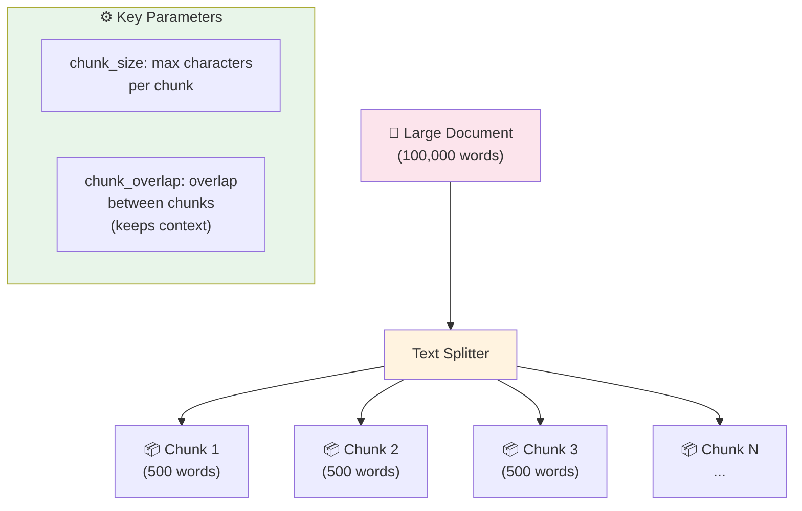

### 💻 Code Example — Text Splitters with Groq

```python
# text_splitters_groq.py
from langchain_text_splitters import (
    RecursiveCharacterTextSplitter,
    CharacterTextSplitter
)
from dotenv import load_dotenv

load_dotenv()

# Sample long text
long_text = """
Python is a high-level, general-purpose programming language. Its design philosophy 
emphasizes code readability with the use of significant indentation. Python is 
dynamically typed and garbage-collected. It supports multiple programming paradigms, 
including structured, object-oriented and functional programming.

Guido van Rossum began working on Python in the late 1980s as a successor to the 
ABC programming language and first released it in 1991 as Python 0.9.0. Python 2.0 
was released in 2000. Python 3.0, released in 2008, was a major revision not 
completely backward-compatible with earlier versions.

Python consistently ranks as one of the most popular programming languages and has 
gained widespread use in the fields of machine learning, data science, web development,
scripting and scientific computing.
""" * 3  # Make it longer

# --- Recursive Character Text Splitter (RECOMMENDED) ---
recursive_splitter = RecursiveCharacterTextSplitter(
    chunk_size=300,        # Max 300 characters per chunk
    chunk_overlap=50,      # 50 character overlap between chunks
    length_function=len,
    separators=["\n\n", "\n", " ", ""]  # Split order of preference
)

recursive_chunks = recursive_splitter.split_text(long_text)
print(f"📊 Recursive Splitter:")
print(f"  Total chunks: {len(recursive_chunks)}")
print(f"  First chunk ({len(recursive_chunks[0])} chars):")
print(f"  '{recursive_chunks[0][:100]}...'\n")

# --- Character Text Splitter ---
char_splitter = CharacterTextSplitter(
    separator="\n\n",      # Split on paragraph breaks
    chunk_size=400,
    chunk_overlap=50
)

char_chunks = char_splitter.split_text(long_text)
print(f"📊 Character Splitter:")
print(f"  Total chunks: {len(char_chunks)}")
```

---

## 12. Embeddings

### 📖 Explanation

**Embeddings** convert text into numbers (vectors) that capture semantic meaning. Similar texts get similar numbers, enabling **semantic search** — finding content by meaning, not just keywords.

**Analogy:** Imagine placing words on a map — similar words appear close together. "Dog" and "puppy" would be nearby, while "database" would be far away.

### 🔢 How Embeddings Work

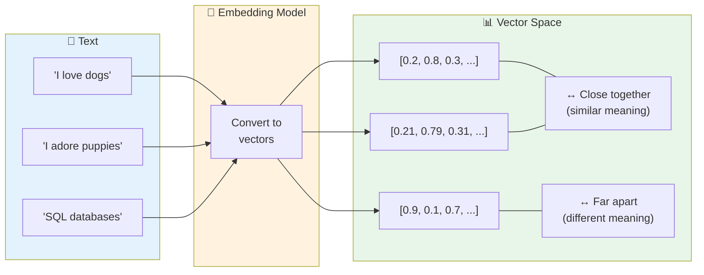

### 💻 Code Example — Embeddings with Google Gemini

```python
# embeddings_gemini.py
from langchain_google_genai import GoogleGenerativeAIEmbeddings
import numpy as np
from dotenv import load_dotenv

load_dotenv()

# Create embedding model
embeddings = GoogleGenerativeAIEmbeddings(model="models/embedding-001")

# Embed single text
text = "Python is a programming language"
vector = embeddings.embed_query(text)
print(f"📊 Embedding for: '{text}'")
print(f"   Vector length: {len(vector)} dimensions")
print(f"   First 5 values: {vector[:5]}\n")

# Embed multiple documents
documents = [
    "I love cats and dogs",
    "Pets are wonderful companions", 
    "Python is great for machine learning",
    "NumPy is a math library"
]

doc_vectors = embeddings.embed_documents(documents)

# Calculate similarity between docs
def cosine_similarity(v1, v2):
    v1, v2 = np.array(v1), np.array(v2)
    return np.dot(v1, v2) / (np.linalg.norm(v1) * np.linalg.norm(v2))

# Compare: How similar are these sentences?
pairs = [(0, 1), (0, 2), (2, 3)]
print("🔍 Similarity Scores (0=different, 1=identical):")
for i, j in pairs:
    score = cosine_similarity(doc_vectors[i], doc_vectors[j])
    print(f"  '{documents[i][:30]}...' \n  vs '{documents[j][:30]}...'\n  → Score: {score:.3f}\n")
```

---

## 13. Vector Stores

### 📖 Explanation

A **Vector Store** is a database designed to store and search through embeddings (vectors). It enables fast semantic search over large collections of documents.

**Analogy:** A regular database stores data in rows/columns. A vector store stores data as coordinates in a mathematical space, enabling search by meaning.

### 🗄️ Vector Store Architecture

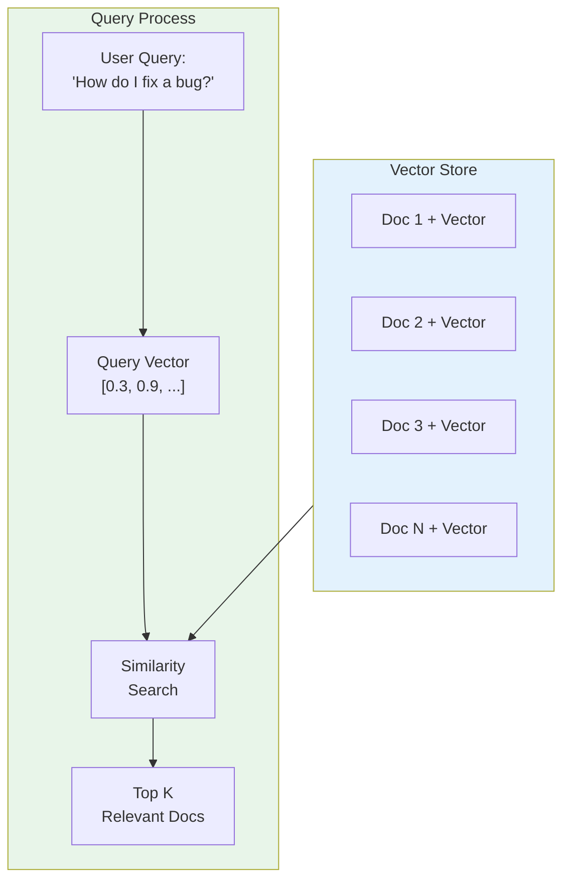

### 💻 Code Example — ChromaDB Vector Store with Gemini

```python
# vector_store_gemini.py
# Install: pip install chromadb
from langchain_google_genai import GoogleGenerativeAIEmbeddings
from langchain_community.vectorstores import Chroma
from langchain_core.documents import Document
from dotenv import load_dotenv

load_dotenv()

# Create embedding model
embeddings = GoogleGenerativeAIEmbeddings(model="models/embedding-001")

# Sample knowledge base
documents = [
    Document(page_content="Python uses indentation to define code blocks.", 
             metadata={"topic": "python", "level": "beginner"}),
    Document(page_content="JavaScript is single-threaded but uses async/await for concurrency.", 
             metadata={"topic": "javascript", "level": "intermediate"}),
    Document(page_content="Docker containers package applications with their dependencies.", 
             metadata={"topic": "devops", "level": "intermediate"}),
    Document(page_content="Machine learning models learn patterns from training data.", 
             metadata={"topic": "ml", "level": "beginner"}),
    Document(page_content="Git tracks changes to files over time using commits.", 
             metadata={"topic": "git", "level": "beginner"}),
]

# Create vector store (in-memory)
vectorstore = Chroma.from_documents(
    documents=documents,
    embedding=embeddings,
    collection_name="tech_knowledge"
)

print("✅ Vector store created with", len(documents), "documents\n")

# Semantic search
queries = [
    "How does Python handle code structure?",
    "What is containerization?",
    "How do I track code history?"
]

for query in queries:
    print(f"🔍 Query: '{query}'")
    results = vectorstore.similarity_search(query, k=2)
    for i, doc in enumerate(results, 1):
        print(f"   Result {i}: {doc.page_content}")
    print()
```

### 💻 Code Example — FAISS Vector Store with Groq

```python
# faiss_vector_store_groq.py
# Install: pip install faiss-cpu
from langchain_google_genai import GoogleGenerativeAIEmbeddings  # Groq doesn't have embeddings
from langchain_community.vectorstores import FAISS
from langchain_core.documents import Document
from dotenv import load_dotenv

load_dotenv()

embeddings = GoogleGenerativeAIEmbeddings(model="models/embedding-001")

# Create documents
texts = [
    "LangChain makes building LLM apps easy",
    "FAISS is a fast similarity search library by Facebook",
    "Embeddings represent text as numerical vectors",
    "Vector stores enable semantic search at scale",
    "RAG combines retrieval with generation"
]

# Create FAISS vector store
vectorstore = FAISS.from_texts(texts, embeddings)

# Save to disk
vectorstore.save_local("my_vectorstore")
print("💾 Vector store saved to disk!")

# Load from disk
loaded_vs = FAISS.load_local("my_vectorstore", embeddings, 
                              allow_dangerous_deserialization=True)
print("✅ Vector store loaded from disk!\n")

# Search with similarity scores
results = loaded_vs.similarity_search_with_score("How does semantic search work?", k=3)
print("🔍 Search results (lower score = more similar):")
for doc, score in results:
    print(f"  Score: {score:.4f} | Text: {doc.page_content}")
```

---

## 14. Retrievers

### 📖 Explanation

A **Retriever** is an interface that fetches relevant documents given a query. It's a layer on top of a vector store that standardizes how you search for documents — making it easy to swap different search strategies.

### 🔎 Retriever Types

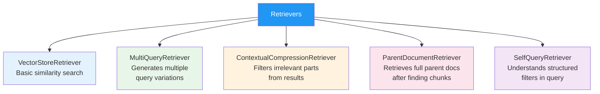

### 💻 Code Example — Retriever with Groq

```python
# retriever_groq.py
from langchain_groq import ChatGroq
from langchain_google_genai import GoogleGenerativeAIEmbeddings
from langchain_community.vectorstores import Chroma
from langchain.retrievers.multi_query import MultiQueryRetriever
from langchain_core.documents import Document
from dotenv import load_dotenv

load_dotenv()

llm = ChatGroq(model="llama3-8b-8192", temperature=0)
embeddings = GoogleGenerativeAIEmbeddings(model="models/embedding-001")

# Build knowledge base
docs = [
    Document(page_content="LangChain was created by Harrison Chase in 2022."),
    Document(page_content="LangChain supports Python and JavaScript/TypeScript."),
    Document(page_content="LCEL (LangChain Expression Language) uses the | pipe operator."),
    Document(page_content="Agents in LangChain can use tools to take actions."),
    Document(page_content="RAG stands for Retrieval Augmented Generation."),
]

vectorstore = Chroma.from_documents(docs, embeddings)

# --- Basic Retriever ---
basic_retriever = vectorstore.as_retriever(
    search_type="similarity",
    search_kwargs={"k": 2}  # Return top 2 results
)

print("🔍 Basic Retriever:")
results = basic_retriever.invoke("Who made LangChain?")
for doc in results:
    print(f"  → {doc.page_content}")

# --- MultiQuery Retriever (generates multiple search queries) ---
multi_retriever = MultiQueryRetriever.from_llm(
    retriever=basic_retriever,
    llm=llm
)

print("\n🔍 MultiQuery Retriever (searches from different angles):")
results = multi_retriever.invoke("What languages can I use with LangChain?")
for doc in results:
    print(f"  → {doc.page_content}")
```

---

## 15. RAG — Retrieval Augmented Generation

### 📖 Explanation

**RAG** combines a retriever with an LLM. Instead of relying on the LLM's training data (which may be outdated or not know your specific data), RAG first **retrieves** relevant documents, then uses the LLM to **generate** an answer based on those documents.

**Real-world use case:** Building a chatbot that answers questions about YOUR company's documents, policies, or products.

### 🏗️ RAG Architecture

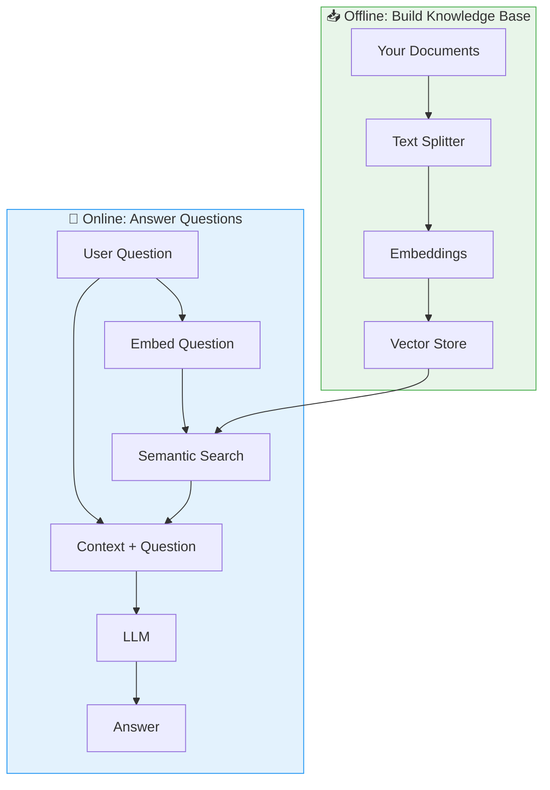

### 💻 Code Example — Complete RAG System with Groq

```python
# rag_groq.py
from langchain_groq import ChatGroq
from langchain_google_genai import GoogleGenerativeAIEmbeddings
from langchain_community.vectorstores import Chroma
from langchain_core.prompts import ChatPromptTemplate
from langchain_core.output_parsers import StrOutputParser
from langchain_core.runnables import RunnablePassthrough
from langchain_text_splitters import RecursiveCharacterTextSplitter
from dotenv import load_dotenv

load_dotenv()

# Initialize models
llm = ChatGroq(model="llama3-70b-8192", temperature=0.2)
embeddings = GoogleGenerativeAIEmbeddings(model="models/embedding-001")

# === STEP 1: Your Knowledge Base ===
company_docs = """
ACME Corp Employee Handbook

Vacation Policy:
Employees receive 15 days of paid vacation per year. Vacation days accrue at 1.25 
days per month. Unused vacation days can be carried over to the next year, up to a 
maximum of 10 days.

Work From Home Policy:
Employees may work from home up to 3 days per week. Remote work days must be approved
by your manager at least 24 hours in advance. Core hours are 10 AM - 3 PM in your
local timezone.

Health Benefits:
Full-time employees receive comprehensive health insurance starting day 1. Coverage
includes medical, dental, and vision. The company covers 80% of premiums for employees
and 60% for dependents.

Expense Reimbursement:
Business expenses under $100 can be submitted via the expense app without prior approval.
Expenses over $100 require manager approval before submission. All expenses must be
submitted within 30 days of the expenditure.
"""

# === STEP 2: Split and Store ===
splitter = RecursiveCharacterTextSplitter(chunk_size=400, chunk_overlap=50)
chunks = splitter.split_text(company_docs)

vectorstore = Chroma.from_texts(chunks, embeddings)
retriever = vectorstore.as_retriever(search_kwargs={"k": 3})

# === STEP 3: RAG Prompt ===
rag_prompt = ChatPromptTemplate.from_template("""
Answer the question based ONLY on the following context. 
If the answer is not in the context, say "I don't have that information."

Context:
{context}

Question: {question}

Answer:""")

# === STEP 4: Build RAG Chain ===
def format_docs(docs):
    return "\n\n".join([doc.page_content for doc in docs])

rag_chain = (
    {"context": retriever | format_docs, "question": RunnablePassthrough()}
    | rag_prompt
    | llm
    | StrOutputParser()
)

# === STEP 5: Ask Questions ===
questions = [
    "How many vacation days do I get?",
    "Can I work from home every day?",
    "When does health insurance start?",
    "What's the CEO's salary?"  # Not in docs
]

for q in questions:
    answer = rag_chain.invoke(q)
    print(f"❓ {q}")
    print(f"💬 {answer}\n")
```

### 💻 Code Example — RAG with Gemini & PDF

```python
# rag_gemini_pdf.py
from langchain_google_genai import ChatGoogleGenerativeAI, GoogleGenerativeAIEmbeddings
from langchain_community.vectorstores import FAISS
from langchain_core.prompts import ChatPromptTemplate
from langchain_core.output_parsers import StrOutputParser
from langchain_core.runnables import RunnablePassthrough
from langchain_text_splitters import RecursiveCharacterTextSplitter
from langchain_core.documents import Document
from dotenv import load_dotenv

load_dotenv()

llm = ChatGoogleGenerativeAI(model="gemini-1.5-flash", temperature=0.2)
embeddings = GoogleGenerativeAIEmbeddings(model="models/embedding-001")

def create_rag_app(texts: list[str], system_context: str = ""):
    """Generic RAG app factory"""
    
    # Split texts
    splitter = RecursiveCharacterTextSplitter(chunk_size=500, chunk_overlap=100)
    docs = [Document(page_content=t) for t in texts]
    splits = splitter.split_documents(docs)
    
    # Vector store
    vectorstore = FAISS.from_documents(splits, embeddings)
    retriever = vectorstore.as_retriever(search_kwargs={"k": 3})
    
    # Prompt
    prompt = ChatPromptTemplate.from_template(f"""
    {system_context}
    
    Use this context to answer:
    {{context}}
    
    Question: {{question}}
    """)
    
    # Chain
    chain = (
        {"context": retriever | (lambda docs: "\n\n".join(d.page_content for d in docs)),
         "question": RunnablePassthrough()}
        | prompt | llm | StrOutputParser()
    )
    
    return chain

# Create a science RAG app
science_texts = [
    "Photosynthesis is the process by which plants convert sunlight, water and CO2 into glucose and oxygen.",
    "The mitochondria is the powerhouse of the cell, producing ATP through cellular respiration.",
    "DNA (deoxyribonucleic acid) contains genetic information encoded in 4 bases: A, T, G, C.",
    "Neurons transmit signals through electrochemical impulses called action potentials.",
]

science_bot = create_rag_app(science_texts, "You are a science tutor for high school students.")

print(science_bot.invoke("How do plants make their food?"))
```

---

## 16. Agents

### 📖 Explanation

**Agents** are AI systems that can **reason** about which actions to take and **use tools** to accomplish a goal. Unlike chains (fixed sequence), agents dynamically decide what to do next based on the results of previous actions.

**Analogy:** A chain is like a train on fixed rails. An agent is like a taxi driver — it decides its own route based on the destination and conditions.

### 🤖 Agent Decision Loop (ReAct)

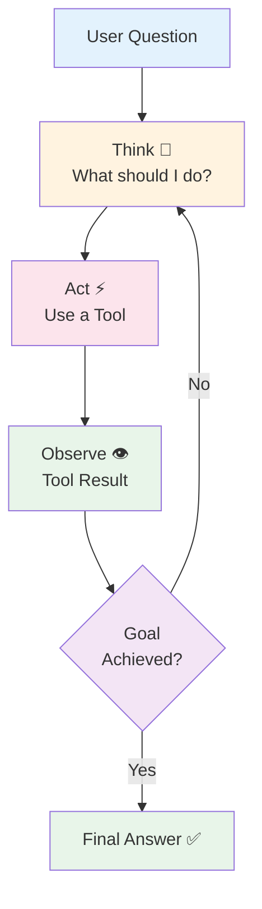

### 💻 Code Example — Agent with Groq

```python
# agent_groq.py
from langchain_groq import ChatGroq
from langchain.agents import create_react_agent, AgentExecutor
from langchain_core.tools import tool
from langchain import hub
from dotenv import load_dotenv
import math

load_dotenv()

llm = ChatGroq(model="llama3-70b-8192", temperature=0)

# === Define Tools ===
@tool
def calculator(expression: str) -> str:
    """Evaluates a mathematical expression. Use for any math calculations."""
    try:
        result = eval(expression, {"__builtins__": {}, "math": math})
        return f"Result: {result}"
    except Exception as e:
        return f"Error: {e}"

@tool
def word_counter(text: str) -> str:
    """Counts the number of words in a given text."""
    count = len(text.split())
    return f"Word count: {count}"

@tool
def reverse_text(text: str) -> str:
    """Reverses a given text string."""
    return f"Reversed: {text[::-1]}"

# === Create Agent ===
tools = [calculator, word_counter, reverse_text]

# Pull a ReAct prompt from LangChain Hub
prompt = hub.pull("hwchase17/react")

agent = create_react_agent(llm, tools, prompt)
agent_executor = AgentExecutor(agent=agent, tools=tools, verbose=True, max_iterations=5)

# === Run Agent ===
result = agent_executor.invoke({
    "input": "What is 256 raised to the power of 0.5? Also, how many words are in 'Hello World from LangChain'?"
})

print(f"\n✅ Final Answer: {result['output']}")
```

### 💻 Code Example — Agent with Gemini & Web Search

```python
# agent_gemini_search.py
from langchain_google_genai import ChatGoogleGenerativeAI
from langchain.agents import create_react_agent, AgentExecutor
from langchain_core.tools import tool
from langchain import hub
from datetime import datetime
from dotenv import load_dotenv

load_dotenv()

llm = ChatGoogleGenerativeAI(model="gemini-1.5-flash", temperature=0)

@tool
def get_current_time(timezone: str = "UTC") -> str:
    """Gets the current date and time."""
    now = datetime.now()
    return f"Current time: {now.strftime('%Y-%m-%d %H:%M:%S')} {timezone}"

@tool  
def convert_currency(amount: float, from_currency: str, to_currency: str) -> str:
    """Converts currency. Note: Uses approximate rates for demo."""
    rates = {"USD": 1.0, "EUR": 0.92, "GBP": 0.79, "JPY": 149.5, "INR": 83.0}
    if from_currency not in rates or to_currency not in rates:
        return f"Unsupported currency. Supported: {list(rates.keys())}"
    converted = amount * rates[to_currency] / rates[from_currency]
    return f"{amount} {from_currency} = {converted:.2f} {to_currency}"

@tool
def fibonacci(n: int) -> str:
    """Returns the nth Fibonacci number."""
    if n <= 0: return "Please provide a positive integer"
    a, b = 0, 1
    for _ in range(n - 1):
        a, b = b, a + b
    return f"Fibonacci({n}) = {a}"

tools = [get_current_time, convert_currency, fibonacci]
prompt = hub.pull("hwchase17/react")
agent = create_react_agent(llm, tools, prompt)
executor = AgentExecutor(agent=agent, tools=tools, verbose=False, max_iterations=5)

result = executor.invoke({
    "input": "What is the 10th Fibonacci number? Also convert 100 USD to EUR."
})
print(f"✅ {result['output']}")
```

---

## 17. Tools

### 📖 Explanation

**Tools** are functions that an agent can call to interact with the world — searching the web, running code, reading files, calling APIs, etc. Tools extend what an AI can do beyond just generating text.

### 🛠️ Tool Ecosystem

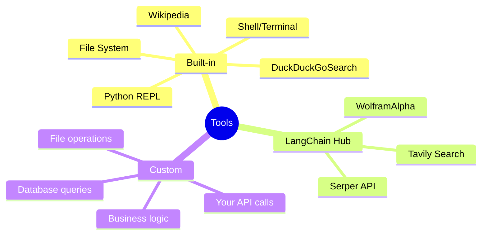

### 💻 Code Example — Creating Custom Tools with Groq

```python
# custom_tools_groq.py
from langchain_groq import ChatGroq
from langchain_core.tools import tool, StructuredTool
from langchain.agents import create_react_agent, AgentExecutor
from langchain import hub
from pydantic import BaseModel, Field
from dotenv import load_dotenv
import random

load_dotenv()

llm = ChatGroq(model="llama3-70b-8192", temperature=0)

# --- Method 1: @tool decorator (simple) ---
@tool
def roll_dice(sides: int = 6) -> str:
    """Rolls a dice with the specified number of sides. Default is 6-sided."""
    result = random.randint(1, sides)
    return f"🎲 Rolled a {sides}-sided dice: {result}"

# --- Method 2: StructuredTool with Pydantic (complex inputs) ---
class WeatherInput(BaseModel):
    city: str = Field(description="The city to get weather for")
    unit: str = Field(description="Temperature unit: celsius or fahrenheit", default="celsius")

def get_weather(city: str, unit: str = "celsius") -> str:
    """Simulated weather tool"""
    # In real life, call a weather API here
    temps = {"London": 15, "New York": 22, "Tokyo": 28, "Sydney": 19}
    temp_c = temps.get(city, random.randint(10, 35))
    if unit == "fahrenheit":
        temp = temp_c * 9/5 + 32
        unit_sym = "°F"
    else:
        temp = temp_c
        unit_sym = "°C"
    return f"Weather in {city}: {temp}{unit_sym}, Partly cloudy"

weather_tool = StructuredTool.from_function(
    func=get_weather,
    name="get_weather",
    description="Gets current weather for a city",
    args_schema=WeatherInput
)

# Use tools
tools = [roll_dice, weather_tool]

print("🔧 Available tools:")
for t in tools:
    print(f"  - {t.name}: {t.description}")

# Test directly
print("\n🎲 Direct tool test:", roll_dice.invoke({"sides": 20}))
print("🌤️ Direct tool test:", weather_tool.invoke({"city": "London", "unit": "fahrenheit"}))

# In an agent
prompt = hub.pull("hwchase17/react")
agent = create_react_agent(llm, tools, prompt)
executor = AgentExecutor(agent=agent, tools=tools, verbose=False)
result = executor.invoke({"input": "What's the weather in Tokyo? Also roll a 20-sided dice."})
print(f"\n✅ Agent Result: {result['output']}")
```

---

## 18. LCEL — LangChain Expression Language

### 📖 Explanation

**LCEL** is LangChain's way to compose components using the `|` (pipe) operator. It's like Unix pipes — connect components in a clean, readable way. LCEL also enables streaming, parallel execution, and async by default.

### 🔗 LCEL Pipe Syntax

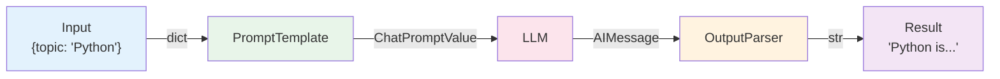

```python
# The pipe operator connects them:
chain = prompt | llm | output_parser
```

### 💻 Code Example — LCEL Features with Groq

```python
# lcel_groq.py
from langchain_groq import ChatGroq
from langchain_core.prompts import ChatPromptTemplate
from langchain_core.output_parsers import StrOutputParser
from langchain_core.runnables import RunnableParallel, RunnablePassthrough, RunnableLambda
from dotenv import load_dotenv

load_dotenv()

llm = ChatGroq(model="llama3-8b-8192", temperature=0.7)

# --- 1. Basic chain ---
basic_chain = (
    ChatPromptTemplate.from_template("Explain {topic} in one sentence.")
    | llm
    | StrOutputParser()
)
print("1️⃣ Basic chain:")
print(basic_chain.invoke({"topic": "recursion"}))

# --- 2. Parallel execution (run multiple chains at once) ---
parallel_chain = RunnableParallel(
    simple=ChatPromptTemplate.from_template("Explain {topic} simply.") | llm | StrOutputParser(),
    technical=ChatPromptTemplate.from_template("Explain {topic} technically.") | llm | StrOutputParser(),
)

print("\n2️⃣ Parallel chain (both run simultaneously):")
results = parallel_chain.invoke({"topic": "machine learning"})
print(f"Simple: {results['simple'][:80]}...")
print(f"Technical: {results['technical'][:80]}...")

# --- 3. RunnableLambda (custom functions in chains) ---
def add_emoji(text: str) -> str:
    return f"🤖 {text}"

def count_words(text: str) -> dict:
    return {"text": text, "word_count": len(text.split())}

custom_chain = (
    ChatPromptTemplate.from_template("Write a haiku about {topic}.")
    | llm
    | StrOutputParser()
    | RunnableLambda(add_emoji)
    | RunnableLambda(count_words)
)

print("\n3️⃣ Custom function chain:")
result = custom_chain.invoke({"topic": "coffee"})
print(f"Text: {result['text']}")
print(f"Word count: {result['word_count']}")
```

### 💻 Code Example — Streaming with Gemini LCEL

```python
# streaming_gemini.py
from langchain_google_genai import ChatGoogleGenerativeAI
from langchain_core.prompts import ChatPromptTemplate
from langchain_core.output_parsers import StrOutputParser
from dotenv import load_dotenv

load_dotenv()

llm = ChatGoogleGenerativeAI(model="gemini-1.5-flash", temperature=0.7)

chain = (
    ChatPromptTemplate.from_template("Write a short story about {topic} in 100 words.")
    | llm
    | StrOutputParser()
)

# Stream output token by token
print("📡 Streaming output:")
print("-" * 40)
for chunk in chain.stream({"topic": "a robot learning to paint"}):
    print(chunk, end="", flush=True)
print("\n" + "-" * 40)
```

---

## 19. Callbacks & Streaming

### 📖 Explanation

**Callbacks** let you hook into LangChain's execution at various points — when an LLM starts, when it produces a token, when a chain ends, etc. **Streaming** delivers tokens one-by-one as they're generated, instead of waiting for the full response.

### 🎣 Callback Events

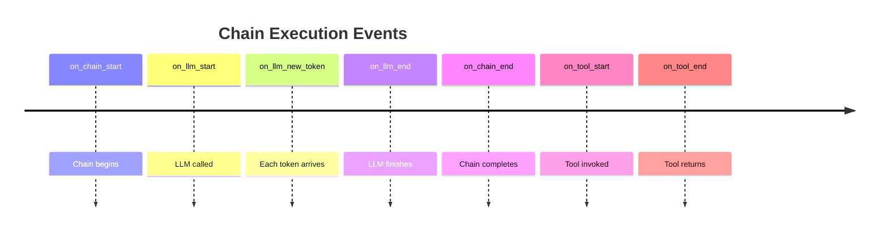

### 💻 Code Example — Custom Callback with Groq

```python
# callbacks_groq.py
from langchain_groq import ChatGroq
from langchain_core.callbacks import BaseCallbackHandler
from langchain_core.prompts import ChatPromptTemplate
from langchain_core.output_parsers import StrOutputParser
import time
from dotenv import load_dotenv

load_dotenv()

class TimingCallback(BaseCallbackHandler):
    """Measures execution time and counts tokens"""
    
    def __init__(self):
        self.start_time = None
        self.token_count = 0
    
    def on_llm_start(self, serialized, prompts, **kwargs):
        self.start_time = time.time()
        self.token_count = 0
        print("⏱️  LLM started...")
    
    def on_llm_new_token(self, token, **kwargs):
        self.token_count += 1
        print(token, end="", flush=True)  # Stream each token
    
    def on_llm_end(self, response, **kwargs):
        elapsed = time.time() - self.start_time
        print(f"\n\n📊 Stats: {self.token_count} tokens in {elapsed:.2f}s")
        print(f"   Speed: {self.token_count/elapsed:.1f} tokens/second")

# Use the callback
timing_cb = TimingCallback()
llm = ChatGroq(
    model="llama3-8b-8192", 
    temperature=0.7,
    streaming=True,
    callbacks=[timing_cb]
)

prompt = ChatPromptTemplate.from_template("List 5 benefits of {topic}.")
chain = prompt | llm | StrOutputParser()

print("📡 Streaming with timing callback:\n")
result = chain.invoke({"topic": "exercise"}, config={"callbacks": [timing_cb]})
```

---

## 20. Structured Output

### 📖 Explanation

**Structured Output** tells the LLM to return data in a specific format (JSON, typed objects) that you define upfront. This is more reliable than parsing free-form text. LangChain's `.with_structured_output()` method makes this easy.

### 💻 Code Example — Structured Output with Groq

```python
# structured_output_groq.py
from langchain_groq import ChatGroq
from pydantic import BaseModel, Field
from typing import List, Optional
from dotenv import load_dotenv

load_dotenv()

llm = ChatGroq(model="llama3-70b-8192", temperature=0)

# Define output structure
class JobPosting(BaseModel):
    """A structured job posting"""
    title: str = Field(description="Job title")
    company: str = Field(description="Company name")
    required_skills: List[str] = Field(description="Required technical skills")
    experience_years: int = Field(description="Years of experience required")
    salary_range: Optional[str] = Field(description="Salary range if mentioned")
    remote_friendly: bool = Field(description="Whether remote work is allowed")

# Bind the structure to the LLM
structured_llm = llm.with_structured_output(JobPosting)

# Extract structured data from job posting text
job_text = """
We're hiring a Senior Python Developer at TechCorp Inc.
You'll need 5+ years of experience with Python, FastAPI, PostgreSQL, and Docker.
Knowledge of AWS and Kubernetes is a plus. The role pays $120k-$150k annually.
This is a hybrid position (3 days remote, 2 days in office).
"""

result = structured_llm.invoke(f"Extract job info from: {job_text}")

print("📋 Extracted Job Posting:")
print(f"  Title: {result.title}")
print(f"  Company: {result.company}")
print(f"  Skills: {result.required_skills}")
print(f"  Experience: {result.experience_years} years")
print(f"  Salary: {result.salary_range}")
print(f"  Remote: {'✅ Yes' if result.remote_friendly else '❌ No'}")
```

### 💻 Code Example — Structured Output with Gemini

```python
# structured_output_gemini.py
from langchain_google_genai import ChatGoogleGenerativeAI
from pydantic import BaseModel, Field
from typing import List
from dotenv import load_dotenv

load_dotenv()

llm = ChatGoogleGenerativeAI(model="gemini-1.5-flash", temperature=0)

class RecipeCard(BaseModel):
    name: str = Field(description="Recipe name")
    cuisine: str = Field(description="Type of cuisine")
    prep_time_minutes: int = Field(description="Preparation time")
    difficulty: str = Field(description="easy/medium/hard")
    ingredients: List[str] = Field(description="List of ingredients")
    steps: List[str] = Field(description="Cooking steps")
    calories_per_serving: int = Field(description="Estimated calories")

structured_llm = llm.with_structured_output(RecipeCard)

recipe = structured_llm.invoke("Give me a simple pasta recipe")

print(f"🍝 {recipe.name} ({recipe.cuisine})")
print(f"⏱️  Prep: {recipe.prep_time_minutes} mins | Difficulty: {recipe.difficulty}")
print(f"🥦 Ingredients: {', '.join(recipe.ingredients[:3])}...")
print(f"📝 Steps: {len(recipe.steps)} steps")
print(f"🔥 Calories: {recipe.calories_per_serving} per serving")
```

---

## 21. Few-Shot Prompting

### 📖 Explanation

**Few-Shot Prompting** gives the LLM a few examples of what you want before asking your actual question. This dramatically improves output quality for specialized tasks.

**Analogy:** Showing someone 3 examples of how to write code reviews before asking them to review YOUR code.

### 📚 Zero-Shot vs Few-Shot

```mermaid
graph LR
    subgraph ZS["Zero-Shot\n(No examples)"]
        ZQ["Q: Classify: 'I love this!'"]
        ZA["A: Positive"]
    end
    
    subgraph FS["Few-Shot\n(With examples)"]
        FE["Example 1: 'Great!' → POSITIVE\nExample 2: 'Terrible!' → NEGATIVE\nExample 3: 'It's okay' → NEUTRAL"]
        FQ["Q: Classify: 'I love this!'"]
        FA["A: POSITIVE (matches format!)"]
        FE --> FQ --> FA
    end

    style ZS fill:#fce4ec
    style FS fill:#e8f5e9
```

### 💻 Code Example — Few-Shot with Groq

```python
# few_shot_groq.py
from langchain_groq import ChatGroq
from langchain_core.prompts import FewShotChatMessagePromptTemplate, ChatPromptTemplate
from langchain_core.output_parsers import StrOutputParser
from dotenv import load_dotenv

load_dotenv()

llm = ChatGroq(model="llama3-8b-8192", temperature=0.2)

# Define examples
examples = [
    {"input": "The package arrived damaged!", "output": "NEGATIVE | Shipping/Delivery | HIGH"},
    {"input": "Customer service was super helpful.", "output": "POSITIVE | Customer Service | LOW"},
    {"input": "Product works as described.", "output": "NEUTRAL | Product Quality | LOW"},
    {"input": "I want my money back NOW!", "output": "NEGATIVE | Refund/Returns | HIGH"},
    {"input": "Five stars! Amazing product!", "output": "POSITIVE | Product Quality | LOW"},
]

# Create few-shot template
example_prompt = ChatPromptTemplate.from_messages([
    ("human", "{input}"),
    ("ai", "{output}"),
])

few_shot_prompt = FewShotChatMessagePromptTemplate(
    example_prompt=example_prompt,
    examples=examples,
)

# Final prompt wrapping the examples
final_prompt = ChatPromptTemplate.from_messages([
    ("system", """Classify customer reviews.
    Format: SENTIMENT | CATEGORY | URGENCY
    Sentiment: POSITIVE/NEGATIVE/NEUTRAL
    Category: Product Quality, Shipping/Delivery, Customer Service, Refund/Returns
    Urgency: LOW/HIGH"""),
    few_shot_prompt,
    ("human", "{input}"),
])

chain = final_prompt | llm | StrOutputParser()

# Test with new reviews
reviews = [
    "I've been waiting 3 weeks and nothing!",
    "The color looks exactly like the photos.",
    "Your support team fixed my issue in 5 minutes!",
]

print("📊 Customer Review Classification:")
for review in reviews:
    result = chain.invoke({"input": review})
    print(f"  Review: '{review}'")
    print(f"  Result: {result}\n")
```

---

## 22. Conversation Chains

### 📖 Explanation

**Conversation Chains** maintain a dialogue history automatically, enabling natural multi-turn conversations. The AI can refer back to earlier messages without you manually managing the history.

### 💻 Code Example — ConversationChain with Groq

```python
# conversation_chain_groq.py
from langchain_groq import ChatGroq
from langchain.chains import ConversationChain
from langchain.memory import ConversationBufferWindowMemory
from langchain_core.prompts import ChatPromptTemplate, MessagesPlaceholder
from dotenv import load_dotenv

load_dotenv()

llm = ChatGroq(model="llama3-8b-8192", temperature=0.7)

# Memory stores last 5 exchanges
memory = ConversationBufferWindowMemory(k=5, return_messages=True)

# Custom prompt for personality
prompt = ChatPromptTemplate.from_messages([
    ("system", """You are ARIA, a friendly and enthusiastic AI assistant.
    You remember everything discussed and build upon previous messages.
    You occasionally refer back to what was said earlier in the conversation."""),
    MessagesPlaceholder(variable_name="history"),
    ("human", "{input}"),
])

conversation = ConversationChain(
    llm=llm,
    memory=memory,
    prompt=prompt,
    verbose=False
)

# Have a flowing conversation
exchanges = [
    "Hi! I'm planning a trip to Japan next spring.",
    "I'm most excited about trying authentic ramen.",
    "What cities should I visit besides Tokyo?",
    "Going back to the ramen — which city has the best ramen?",
    "What's my main reason for visiting again?"  # Tests memory
]

print("🗨️ Conversation with ARIA:\n")
for user_msg in exchanges:
    print(f"👤 You: {user_msg}")
    response = conversation.predict(input=user_msg)
    print(f"🤖 ARIA: {response}\n")
```

---

## 23. Multi-Chain Pipelines

### 📖 Explanation

**Multi-Chain Pipelines** connect multiple chains where the output of one chain feeds into the next. This enables complex, multi-step AI workflows.

### 🏭 Pipeline Flow

```mermaid
flowchart LR
    I[User Input] --> C1[Chain 1\nExtract Topic]
    C1 --> C2[Chain 2\nResearch Facts]
    C2 --> C3[Chain 3\nWrite Article]
    C3 --> C4[Chain 4\nProofread]
    C4 --> O[Final Output]

    style I fill:#e3f2fd
    style C1 fill:#e8f5e9
    style C2 fill:#fff3e0
    style C3 fill:#fce4ec
    style C4 fill:#f3e5f5
    style O fill:#e0f2f1
```

### 💻 Code Example — Content Pipeline with Gemini

```python
# multi_chain_gemini.py
from langchain_google_genai import ChatGoogleGenerativeAI
from langchain_core.prompts import ChatPromptTemplate
from langchain_core.output_parsers import StrOutputParser
from langchain_core.runnables import RunnablePassthrough
from dotenv import load_dotenv

load_dotenv()

llm = ChatGoogleGenerativeAI(model="gemini-1.5-flash", temperature=0.7)
parser = StrOutputParser()

# Chain 1: Research (gather facts)
research_chain = (
    ChatPromptTemplate.from_template(
        "List 5 key facts about {topic}. Be concise, one sentence each."
    ) | llm | parser
)

# Chain 2: Structure (create outline)
outline_chain = (
    ChatPromptTemplate.from_template(
        "Create a blog post outline based on these facts:\n{facts}"
    ) | llm | parser
)

# Chain 3: Write (generate content)
write_chain = (
    ChatPromptTemplate.from_template(
        "Write a 200-word blog post intro based on this outline:\n{outline}"
    ) | llm | parser
)

# Chain 4: Enhance (improve quality)
enhance_chain = (
    ChatPromptTemplate.from_template(
        "Add an engaging hook sentence at the start of this intro:\n{draft}"
    ) | llm | parser
)

def run_content_pipeline(topic: str) -> dict:
    """Run the full content creation pipeline"""
    
    print(f"📝 Creating content about: {topic}\n")
    
    # Step 1: Research
    facts = research_chain.invoke({"topic": topic})
    print(f"✅ Step 1 - Facts gathered ({len(facts.split())} words)")
    
    # Step 2: Outline
    outline = outline_chain.invoke({"facts": facts})
    print(f"✅ Step 2 - Outline created")
    
    # Step 3: Write
    draft = write_chain.invoke({"outline": outline})
    print(f"✅ Step 3 - Draft written")
    
    # Step 4: Enhance
    final = enhance_chain.invoke({"draft": draft})
    print(f"✅ Step 4 - Content enhanced\n")
    
    return {
        "topic": topic,
        "facts": facts,
        "outline": outline,
        "final_content": final
    }

result = run_content_pipeline("quantum computing")
print("=" * 50)
print("📄 FINAL CONTENT:")
print("=" * 50)
print(result["final_content"])
```

---

## 24. LangSmith — Debugging & Observability

### 📖 Explanation

**LangSmith** is LangChain's platform for debugging, testing, and monitoring your LLM applications. It traces every step of your chains and agents so you can see exactly what happened when something goes wrong.

### 🔍 What LangSmith Shows

```mermaid
graph TD
    A[Your App Runs] --> B[LangSmith Captures]
    B --> C[Input to each step]
    B --> D[Output from each step]
    B --> E[Latency per step]
    B --> F[Token usage & cost]
    B --> G[Errors & exceptions]
    B --> H[Full prompt sent to LLM]

    style A fill:#e3f2fd
    style B fill:#fff3e0
    style C fill:#e8f5e9
    style D fill:#e8f5e9
    style E fill:#e8f5e9
    style F fill:#e8f5e9
    style G fill:#fce4ec
    style H fill:#e8f5e9
```

### 💻 Code Example — LangSmith Setup with Groq

```python
# langsmith_groq.py
import os
from dotenv import load_dotenv

load_dotenv()

# Add to your .env file:
# LANGCHAIN_TRACING_V2=true
# LANGCHAIN_API_KEY=your_langsmith_key
# LANGCHAIN_PROJECT=my-project

# Enable LangSmith tracing
os.environ["LANGCHAIN_TRACING_V2"] = "true"
os.environ["LANGCHAIN_PROJECT"] = "LangChain Tutorial"
# os.environ["LANGCHAIN_API_KEY"] = "your_api_key"

from langchain_groq import ChatGroq
from langchain_core.prompts import ChatPromptTemplate
from langchain_core.output_parsers import StrOutputParser

llm = ChatGroq(model="llama3-8b-8192", temperature=0.7)

chain = (
    ChatPromptTemplate.from_template("Tell me a fun fact about {topic}")
    | llm
    | StrOutputParser()
)

# This run will be traced in LangSmith
result = chain.invoke({"topic": "space"})
print(result)

# Get LangSmith at: https://smith.langchain.com
print("\n✅ Check your run at https://smith.langchain.com")
```

---

## 25. Building a Complete App

### 📖 Explanation

Let's put everything together and build a **complete AI Study Assistant** that:
- Has a personality (system prompt)
- Remembers conversations (memory)
- Can search a knowledge base (RAG)
- Provides structured responses (output parser)

### 🏗️ Final App Architecture

```mermaid
graph TB
    USER[👤 User] --> UI[Study Assistant]
    
    subgraph APP["🎓 AI Study Assistant"]
        UI --> ROUTER{Question\nType?}
        ROUTER --> |"About study material"| RAG[RAG Chain]
        ROUTER --> |"General question"| CHAT[Chat Chain]
        
        RAG --> KB[(Knowledge Base\nVector Store)]
        KB --> RAG
        
        CHAT --> MEM[Memory]
        RAG --> MEM
    end
    
    subgraph LLM_LAYER["🤖 LLM Layer"]
        GROQ[Groq\nllama3-70b]
        GEM[Gemini\n1.5-flash]
    end
    
    CHAT --> GROQ
    RAG --> GEM
    GROQ --> RESP[📤 Response]
    GEM --> RESP
    RESP --> USER

    style APP fill:#e3f2fd,stroke:#2196f3
    style LLM_LAYER fill:#fce4ec,stroke:#e91e63
```

### 💻 Complete App Code

```python
# study_assistant_app.py
"""
Complete AI Study Assistant using LangChain
Uses Groq for chat and Gemini for RAG & embeddings
"""

from langchain_groq import ChatGroq
from langchain_google_genai import ChatGoogleGenerativeAI, GoogleGenerativeAIEmbeddings
from langchain_community.vectorstores import Chroma
from langchain.memory import ConversationBufferWindowMemory
from langchain.chains import ConversationChain
from langchain_core.prompts import ChatPromptTemplate, MessagesPlaceholder
from langchain_core.output_parsers import StrOutputParser
from langchain_core.runnables import RunnablePassthrough
from langchain_text_splitters import RecursiveCharacterTextSplitter
from langchain_core.documents import Document
from dotenv import load_dotenv
import os

load_dotenv()

# ============================================================
# CONFIGURATION
# ============================================================
CHAT_MODEL = ChatGroq(model="llama3-70b-8192", temperature=0.7)
RAG_MODEL = ChatGoogleGenerativeAI(model="gemini-1.5-flash", temperature=0.2)
EMBEDDINGS = GoogleGenerativeAIEmbeddings(model="models/embedding-001")

# ============================================================
# KNOWLEDGE BASE (Study Material)
# ============================================================
STUDY_MATERIAL = """
Python Basics:
Variables in Python don't need type declarations. Python uses duck typing.
Lists are mutable: mylist = [1, 2, 3]. Tuples are immutable: mytuple = (1, 2, 3).
Dictionaries store key-value pairs: person = {"name": "Alice", "age": 30}.
List comprehensions: squares = [x**2 for x in range(10)].
Lambda functions: double = lambda x: x * 2.
F-strings for formatting: f"Hello, {name}! You are {age} years old."

Object-Oriented Programming:
Classes use the 'class' keyword. __init__ is the constructor.
Inheritance: class Dog(Animal): inherits all methods from Animal.
Encapsulation: use _ prefix for private-ish attributes.
Polymorphism: same method name, different behavior in subclasses.

Python Functions:
*args allows variable positional arguments.
**kwargs allows variable keyword arguments.
Decorators use @ syntax to modify functions.
Generators use 'yield' instead of 'return' for memory efficiency.

Error Handling:
try/except/else/finally blocks handle exceptions.
raise keyword throws exceptions manually.
Custom exceptions inherit from Exception class.
"""

# ============================================================
# BUILD RAG SYSTEM
# ============================================================
def build_knowledge_base(text: str):
    """Convert study material into searchable vector store"""
    splitter = RecursiveCharacterTextSplitter(chunk_size=300, chunk_overlap=50)
    chunks = splitter.split_text(text)
    docs = [Document(page_content=chunk) for chunk in chunks]
    return Chroma.from_documents(docs, EMBEDDINGS)

# ============================================================
# STUDY ASSISTANT CLASS
# ============================================================
class StudyAssistant:
    def __init__(self, subject: str, study_material: str):
        self.subject = subject
        
        # Build knowledge base
        print(f"📚 Building knowledge base for {subject}...")
        vectorstore = build_knowledge_base(study_material)
        self.retriever = vectorstore.as_retriever(search_kwargs={"k": 3})
        
        # Setup memory
        self.memory = ConversationBufferWindowMemory(k=5, return_messages=True)
        
        # RAG Chain (for questions about study material)
        rag_prompt = ChatPromptTemplate.from_template("""
        You are a helpful {subject} tutor.
        Use this context to answer the question:
        
        Context: {context}
        
        Question: {question}
        
        Give a clear, educational answer with examples if helpful.
        """)
        
        self.rag_chain = (
            {
                "context": self.retriever | (lambda docs: "\n\n".join(d.page_content for d in docs)),
                "question": RunnablePassthrough(),
                "subject": lambda _: subject
            }
            | rag_prompt | RAG_MODEL | StrOutputParser()
        )
        
        # Chat Chain (for general questions)
        chat_prompt = ChatPromptTemplate.from_messages([
            ("system", f"You are an enthusiastic and patient {subject} tutor. "
                      f"Make learning fun and use simple analogies."),
            MessagesPlaceholder(variable_name="history"),
            ("human", "{input}")
        ])
        
        self.chat_chain = ConversationChain(
            llm=CHAT_MODEL,
            memory=self.memory,
            prompt=chat_prompt,
            verbose=False
        )
        
        print(f"✅ {subject} Study Assistant ready!\n")
    
    def ask(self, question: str, use_rag: bool = True) -> str:
        """Ask a question to the study assistant"""
        if use_rag:
            # Use RAG for specific knowledge questions
            return self.rag_chain.invoke(question)
        else:
            # Use conversational chain for general questions
            return self.chat_chain.predict(input=question)
    
    def study_session(self, questions: list[tuple[str, bool]]):
        """Run a study session with multiple questions"""
        print(f"🎓 Starting {self.subject} Study Session")
        print("=" * 60)
        
        for question, use_rag in questions:
            mode = "📖 RAG" if use_rag else "💬 Chat"
            print(f"\n{mode} | ❓ {question}")
            print("-" * 40)
            answer = self.ask(question, use_rag=use_rag)
            print(f"🤖 {answer}")
            print()

# ============================================================
# MAIN
# ============================================================
if __name__ == "__main__":
    # Create the assistant
    assistant = StudyAssistant("Python Programming", STUDY_MATERIAL)
    
    # Study session
    study_questions = [
        ("What are list comprehensions in Python?", True),          # RAG
        ("Can you give me a harder list comprehension example?", False),  # Chat (uses context)
        ("What's the difference between lists and tuples?", True),  # RAG
        ("How do I handle errors in Python?", True),                # RAG
        ("Can you quiz me on what we just covered?", False),        # Chat
    ]
    
    assistant.study_session(study_questions)
```

---

## 🎓 Summary: Your LangChain Learning Path

```mermaid
journey
    title LangChain Learning Journey
    section Week 1 - Foundations
      Setup & LLMs: 5: Beginner
      Prompt Templates: 4: Beginner
      Output Parsers: 4: Beginner
      Messages & Chat: 4: Beginner
    section Week 2 - Data
      Document Loaders: 3: Learner
      Text Splitters: 3: Learner
      Embeddings: 2: Learner
      Vector Stores: 2: Learner
    section Week 3 - Intermediate
      Chains & LCEL: 4: Learner
      RAG Systems: 3: Learner
      Memory: 4: Learner
      Retrievers: 3: Learner
    section Week 4 - Advanced
      Agents & Tools: 2: Developer
      Callbacks: 3: Developer
      Structured Output: 4: Developer
      Full Apps: 3: Developer
```

## 📦 Complete requirements.txt

```txt
# Core LangChain
langchain>=0.3.0
langchain-core>=0.3.0
langchain-community>=0.3.0
langchain-text-splitters>=0.3.0

# LLM Providers
langchain-groq>=0.2.0
langchain-google-genai>=2.0.0

# Vector Stores
chromadb>=0.5.0
faiss-cpu>=1.8.0

# Document Loaders
pypdf>=4.0.0

# Utilities
python-dotenv>=1.0.0
pydantic>=2.0.0
numpy>=1.24.0
```

## 🔑 Quick Reference Cheat Sheet

| Task | Groq Code | Gemini Code |
|------|-----------|-------------|
| Init LLM | `ChatGroq(model="llama3-8b-8192")` | `ChatGoogleGenerativeAI(model="gemini-1.5-flash")` |
| Basic call | `llm.invoke("Hello")` | `llm.invoke("Hello")` |
| Stream | `for chunk in llm.stream(...)` | `for chunk in llm.stream(...)` |
| With prompt | `prompt \| llm \| parser` | `prompt \| llm \| parser` |
| Structured | `llm.with_structured_output(Model)` | `llm.with_structured_output(Model)` |
| Embeddings | *(Use Gemini for embeddings)* | `GoogleGenerativeAIEmbeddings(model="models/embedding-001")` |

---

## 🚀 What to Build Next?

```mermaid
graph LR
    YOU[You Now!] --> P1["🤖 Customer\nSupport Bot"]
    YOU --> P2["📚 Document\nQ&A System"]
    YOU --> P3["📝 Content\nGenerator"]
    YOU --> P4["🔍 Research\nAssistant"]
    YOU --> P5["💬 Personal\nChatbot"]

    style YOU fill:#4caf50,color:white
    style P1 fill:#e3f2fd
    style P2 fill:#e8f5e9
    style P3 fill:#fff3e0
    style P4 fill:#fce4ec
    style P5 fill:#f3e5f5
```

---

*Built with ❤️ for LangChain beginners | Uses Groq & Google Gemini LLM Providers*

*🦜 LangChain Docs: https://python.langchain.com | 🔥 Groq: https://groq.com | 💎 Gemini: https://aistudio.google.com*
