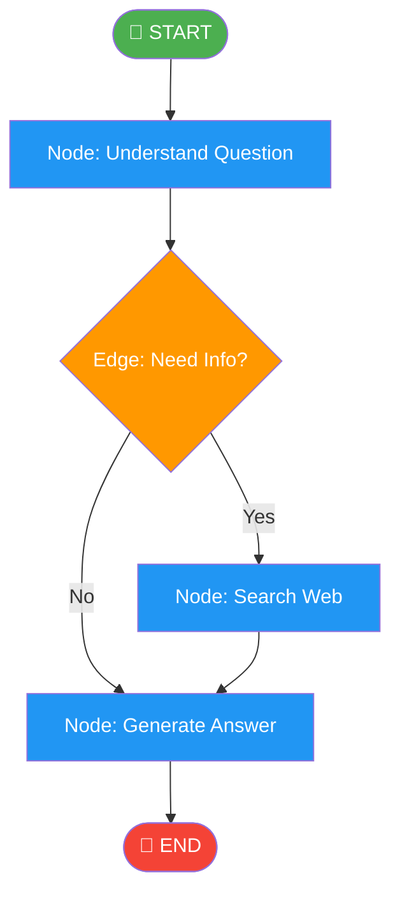
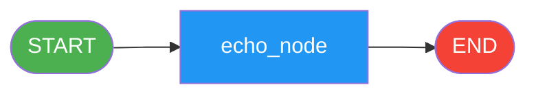
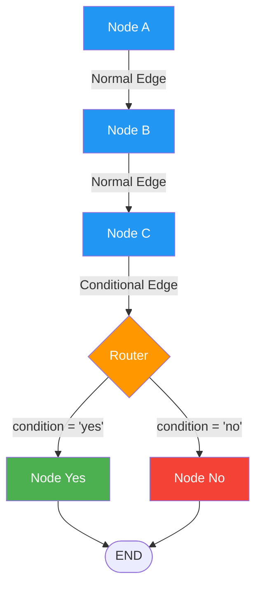
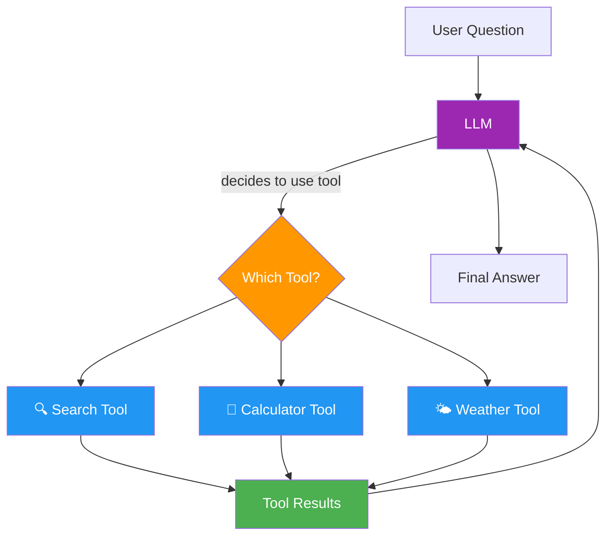
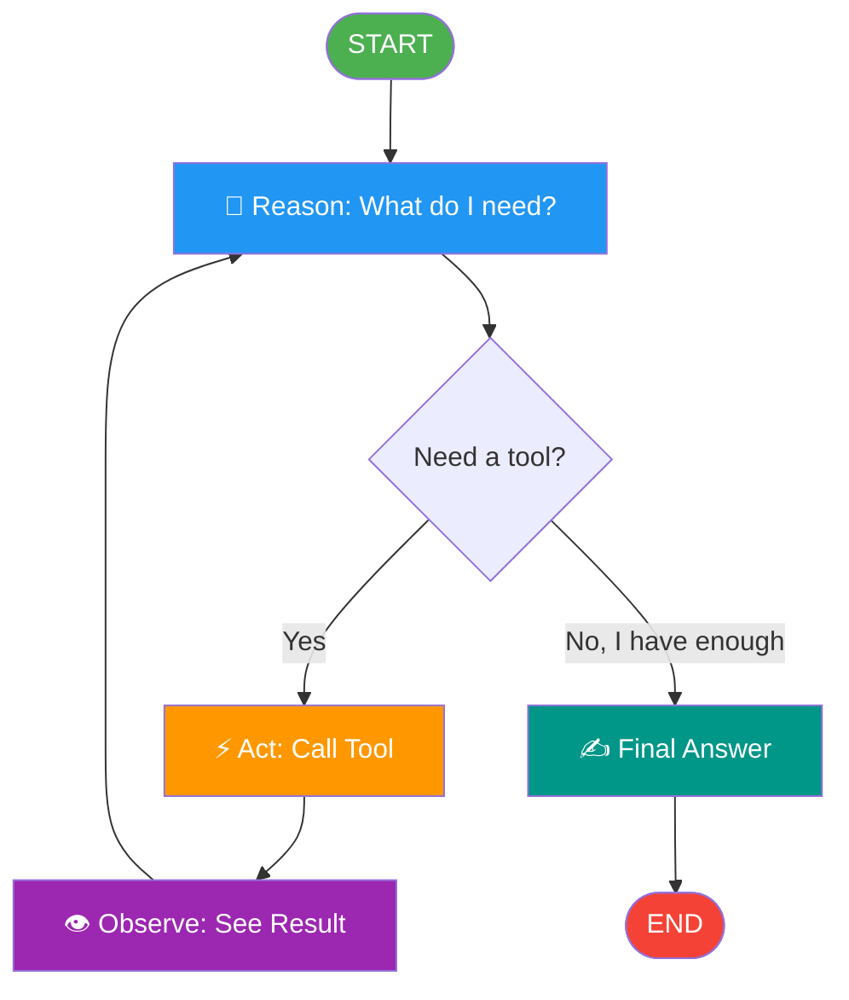
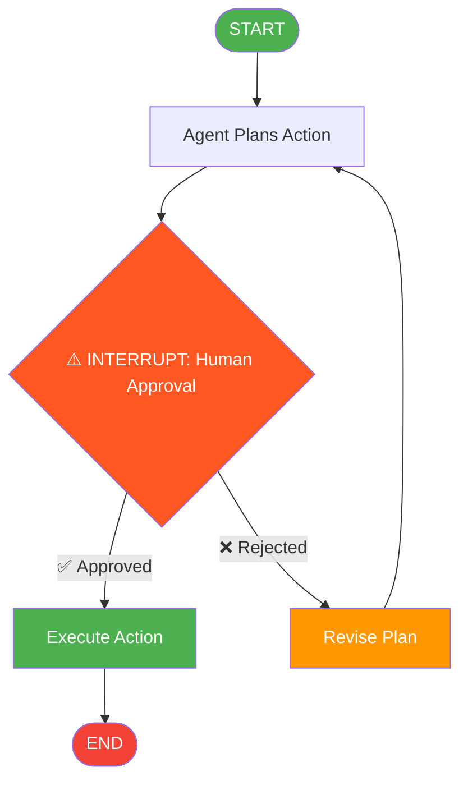
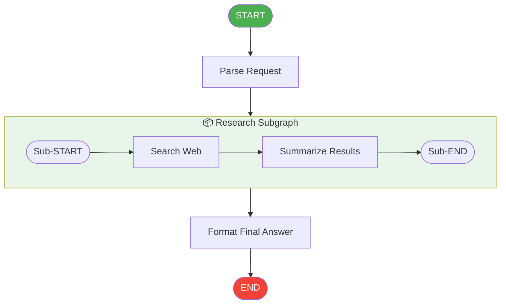
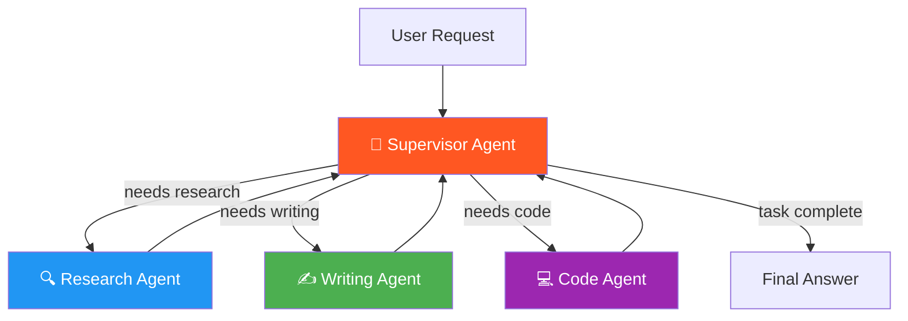
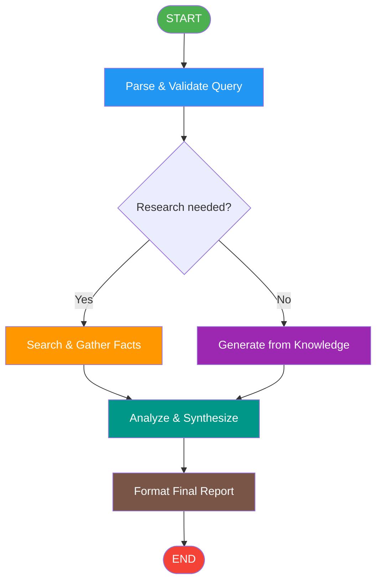
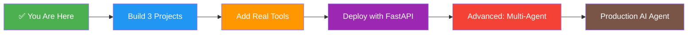

# 🧠 LangGraph for Absolute Beginners
### A Complete Guide to Building Agentic AI with Python

> **Version:** 1.0 | **Level:** Absolute Beginner | **LLM Providers:** Groq & Google Gemini

---

## 📋 Table of Contents

1. [What is LangGraph?](#concept-1-what-is-langgraph)
2. [Why LangGraph? (vs Simple LLM Calls)](#concept-2-why-langgraph)
3. [Core Architecture: Graphs, Nodes & Edges](#concept-3-core-architecture)
4. [State: The Memory of Your Graph](#concept-4-state)
5. [Your First LangGraph App](#concept-5-your-first-langgraph-app)
6. [Setting Up LLM Providers](#concept-6-setting-up-llm-providers)
7. [Nodes: The Workers](#concept-7-nodes)
8. [Edges: The Connectors](#concept-8-edges)
9. [Conditional Edges: Decision Making](#concept-9-conditional-edges)
10. [StateGraph: The Blueprint](#concept-10-stategraph)
11. [TypedDict for State Management](#concept-11-typeddict)
12. [Tools: Giving AI Superpowers](#concept-12-tools)
13. [Tool Nodes: Executing Tools](#concept-13-tool-nodes)
14. [ReAct Agent Pattern](#concept-14-react-agent)
15. [Memory & Persistence (Checkpointing)](#concept-15-memory-and-persistence)
16. [Human-in-the-Loop](#concept-16-human-in-the-loop)
17. [Streaming Responses](#concept-17-streaming)
18. [Subgraphs: Graphs Within Graphs](#concept-18-subgraphs)
19. [Parallel Execution with Fan-Out](#concept-19-parallel-execution)
20. [Error Handling in Graphs](#concept-20-error-handling)
21. [Multi-Agent Systems](#concept-21-multi-agent-systems)
22. [Graph Visualization](#concept-22-graph-visualization)
23. [Real-World Project: Research Assistant Agent](#concept-23-real-world-project)
24. [Best Practices & Patterns](#concept-24-best-practices)
25. [Next Steps & Resources](#concept-25-next-steps)

---

## 🛠️ Prerequisites & Installation

```bash
# Install required packages
pip install langgraph langchain langchain-groq langchain-google-genai python-dotenv

# Optional but recommended
pip install langchain-community tavily-python
```

```bash
# .env file setup
GROQ_API_KEY=your_groq_api_key_here
GOOGLE_API_KEY=your_google_gemini_api_key_here
TAVILY_API_KEY=your_tavily_api_key_here  # for web search tool
```

---

## Concept 1: What is LangGraph?

### 📖 Explanation

LangGraph is a Python library built on top of LangChain that lets you create **AI agents as graphs**. Think of it like a flowchart — but instead of humans following the steps, AI models do the work.

Imagine you want to build a customer service bot that:
1. Reads your question
2. Decides if it needs to search the web
3. Searches if needed
4. Generates a final answer

Without LangGraph, wiring this together is messy. With LangGraph, you draw a flowchart where each box (node) does one job, and arrows (edges) connect them.

### 🗺️ Infographic: The Big Picture

```
┌─────────────────────────────────────────────────────────┐
│                    LANGGRAPH WORLD                       │
│                                                         │
│   Your Question                                         │
│       │                                                 │
│       ▼                                                 │
│  ┌─────────┐    ┌─────────┐    ┌─────────┐            │
│  │  Node 1  │───▶│  Node 2  │───▶│  Node 3  │           │
│  │ "Think"  │    │ "Search" │    │ "Answer" │           │
│  └─────────┘    └─────────┘    └─────────┘            │
│       │               │               │                 │
│       └───────────────┴───────────────┘                 │
│                       │                                 │
│                 Shared State                            │
│              (like a notebook                           │
│               everyone reads)                           │
└─────────────────────────────────────────────────────────┘
```

### 🔑 Key Insight

> LangGraph = **Flowchart** + **AI** + **Shared Memory**

---

## Concept 2: Why LangGraph?

### 📖 Explanation

Before LangGraph, building AI agents meant writing complicated, hard-to-maintain code. Let's see the difference:

### ❌ Without LangGraph (Messy Code)

```python
# Traditional approach - hard to maintain
def messy_agent(question):
    response = llm.invoke(question)
    if "search" in response:
        results = search(question)
        response = llm.invoke(f"{question}\nSearch results: {results}")
    if "calculate" in response:
        # more if-else hell...
        pass
    return response
```

### ✅ With LangGraph (Clean & Structured)

```python
# LangGraph approach - clear and maintainable
graph = StateGraph(State)
graph.add_node("think", think_node)
graph.add_node("search", search_node)
graph.add_node("answer", answer_node)
graph.add_conditional_edges("think", decide_next_step)
agent = graph.compile()
result = agent.invoke({"question": "What is AI?"})
```

### 📊 Comparison Table

```
┌─────────────────┬─────────────────┬─────────────────┐
│    Feature       │  Without LangGraph  │  With LangGraph  │
├─────────────────┼─────────────────┼─────────────────┤
│ Code Structure  │   Messy if/else  │  Clean & Visual  │
│ Memory/State    │   Manual tracking│  Built-in State  │
│ Multi-step AI   │   Very hard      │  Easy with nodes │
│ Debugging       │   Nightmare      │  Visual graphs   │
│ Loops & Cycles  │   Spaghetti code │  Simple cycles   │
│ Human Approval  │   Custom coding  │  Built-in        │
└─────────────────┴─────────────────┴─────────────────┘
```

---

## Concept 3: Core Architecture

### 📖 Explanation

LangGraph has 3 fundamental building blocks:

1. **Nodes** → Functions that DO something (call an LLM, search the web, calculate)
2. **Edges** → Arrows that connect nodes (always go here, OR decide at runtime)
3. **State** → A shared dictionary that all nodes can read and write to

### 🗺️ Architecture Diagram



### 🔑 Mental Model

```
GRAPH = A network of tasks
NODE  = A single task (a Python function)
EDGE  = "After this task, go to THAT task"
STATE = A shared notebook everyone passes around
```

---

## Concept 4: State — The Memory of Your Graph

### 📖 Explanation

State is like a **shared notebook** that travels through every node. When Node 1 writes something, Node 2 can read it. This is how nodes "talk" to each other without directly calling each other.

### 🗺️ State Flow Infographic

```
┌──────────────────────────────────────────────────────────┐
│                    STATE NOTEBOOK 📓                      │
│                                                          │
│  { "messages": [                                         │
│      HumanMessage("What is AI?"),                        │
│      AIMessage("Searching..."),      ◀── Node 1 wrote   │
│      AIMessage("AI is...")           ◀── Node 2 wrote   │
│    ],                                                    │
│    "search_results": [...],          ◀── Tool wrote      │
│    "final_answer": "..."             ◀── Node 3 wrote   │
│  }                                                       │
│                                                          │
│  Every node READS from here and WRITES to here          │
└──────────────────────────────────────────────────────────┘
```

### 💡 Simple State Example

```python
from typing import TypedDict, Annotated
from langgraph.graph.message import add_messages

# Define what your state looks like
class SimpleState(TypedDict):
    # "messages" is a list that grows (add_messages handles this)
    messages: Annotated[list, add_messages]

# Start state - just the user's question
initial_state = {
    "messages": [("user", "What is the capital of France?")]
}
```

### 🔑 Key Rule

> **State is IMMUTABLE per node.** Each node returns a NEW state. LangGraph merges them automatically.

---

## Concept 5: Your First LangGraph App

### 📖 Explanation

Let's build the simplest possible LangGraph application — a single node that echoes back a message. This teaches the skeleton structure every LangGraph app follows.

### 🗺️ Flow Diagram



### 💻 Code Example (Groq)

```python
# first_graph_groq.py
from typing import TypedDict, Annotated
from langgraph.graph import StateGraph, START, END
from langgraph.graph.message import add_messages
from langchain_groq import ChatGroq
from dotenv import load_dotenv

load_dotenv()

# Step 1: Define State
class State(TypedDict):
    messages: Annotated[list, add_messages]

# Step 2: Initialize LLM
llm = ChatGroq(model="llama-3.1-8b-instant")

# Step 3: Define a Node (just a Python function!)
def chatbot_node(state: State):
    """This node calls the LLM and returns a response."""
    response = llm.invoke(state["messages"])
    return {"messages": [response]}  # Return new/updated state

# Step 4: Build the Graph
graph_builder = StateGraph(State)

# Step 5: Add the node
graph_builder.add_node("chatbot", chatbot_node)

# Step 6: Add edges (connect START → chatbot → END)
graph_builder.add_edge(START, "chatbot")
graph_builder.add_edge("chatbot", END)

# Step 7: Compile (freeze the graph)
graph = graph_builder.compile()

# Step 8: Run it!
result = graph.invoke({"messages": [("user", "Hello! What is LangGraph?")]})
print(result["messages"][-1].content)
```

### 💻 Code Example (Google Gemini)

```python
# first_graph_gemini.py
from typing import TypedDict, Annotated
from langgraph.graph import StateGraph, START, END
from langgraph.graph.message import add_messages
from langchain_google_genai import ChatGoogleGenerativeAI
from dotenv import load_dotenv

load_dotenv()

class State(TypedDict):
    messages: Annotated[list, add_messages]

# ✅ Only difference: use Gemini instead of Groq
llm = ChatGoogleGenerativeAI(model="gemini-1.5-flash")

def chatbot_node(state: State):
    response = llm.invoke(state["messages"])
    return {"messages": [response]}

graph_builder = StateGraph(State)
graph_builder.add_node("chatbot", chatbot_node)
graph_builder.add_edge(START, "chatbot")
graph_builder.add_edge("chatbot", END)
graph = graph_builder.compile()

result = graph.invoke({"messages": [("user", "Hello! What is LangGraph?")]})
print(result["messages"][-1].content)
```

### 🔑 The 8-Step Template

```
1. Define State (TypedDict)
2. Initialize LLM
3. Write Node functions
4. Create StateGraph(State)
5. Add nodes (.add_node)
6. Add edges (.add_edge)
7. Compile (.compile())
8. Invoke (.invoke())
```

---

## Concept 6: Setting Up LLM Providers

### 📖 Explanation

LangGraph is LLM-agnostic — it works with any LLM. Here we set up both **Groq** (ultra-fast inference) and **Google Gemini** (powerful multimodal model).

### 🗺️ Provider Comparison

```
┌──────────────────────────────────────────────────────────┐
│              LLM PROVIDER OVERVIEW                        │
│                                                          │
│  🟠 GROQ                        🔵 GOOGLE GEMINI         │
│  ─────────────────────          ─────────────────────    │
│  • Lightning fast               • Powerful & multimodal  │
│  • Free tier available          • Free tier available    │
│  • Models: llama3, mixtral      • Models: gemini-1.5     │
│  • Great for quick responses    • Great for complex tasks│
│  • from langchain_groq import   • from langchain_google_ │
│    ChatGroq                       genai import           │
│                                   ChatGoogleGenerativeAI │
└──────────────────────────────────────────────────────────┘
```

### 💻 Provider Setup Code

```python
# provider_setup.py
import os
from dotenv import load_dotenv
from langchain_groq import ChatGroq
from langchain_google_genai import ChatGoogleGenerativeAI

load_dotenv()

# ──────────────────────────────────────
# GROQ SETUP
# ──────────────────────────────────────
groq_llm = ChatGroq(
    model="llama-3.1-8b-instant",   # Fast & free
    # model="llama-3.3-70b-versatile",  # More powerful
    temperature=0.7,
    max_tokens=1024,
)

# ──────────────────────────────────────
# GOOGLE GEMINI SETUP
# ──────────────────────────────────────
gemini_llm = ChatGoogleGenerativeAI(
    model="gemini-1.5-flash",        # Fast & free
    # model="gemini-1.5-pro",         # More powerful
    temperature=0.7,
    max_output_tokens=1024,
)

# ──────────────────────────────────────
# TEST BOTH
# ──────────────────────────────────────
def test_providers():
    test_prompt = "Say 'Hello from {provider}!' in one sentence."

    print("🟠 Testing Groq...")
    groq_response = groq_llm.invoke(test_prompt.format(provider="Groq"))
    print(f"   Groq says: {groq_response.content}")

    print("🔵 Testing Gemini...")
    gemini_response = gemini_llm.invoke(test_prompt.format(provider="Gemini"))
    print(f"   Gemini says: {gemini_response.content}")

if __name__ == "__main__":
    test_providers()
```

### 🔑 Available Groq Models

```
llama-3.1-8b-instant     → Fastest, great for simple tasks
llama-3.3-70b-versatile  → Balanced speed & quality
mixtral-8x7b-32768       → Long context window (32k tokens)
```

### 🔑 Available Gemini Models

```
gemini-1.5-flash         → Fast & efficient
gemini-1.5-pro           → Most capable
gemini-2.0-flash         → Latest, very fast
```

---

## Concept 7: Nodes — The Workers

### 📖 Explanation

Nodes are just **Python functions** that:
- **Accept** the current state as input
- **Do something** (call LLM, search, calculate, etc.)
- **Return** a dictionary with the updated parts of state

### 🗺️ Node Anatomy

```
┌─────────────────────────────────────────────┐
│              NODE FUNCTION                   │
│                                             │
│  def my_node(state: State) -> dict:         │
│      │                                      │
│      ├── 📥 INPUT: current state            │
│      │   (read messages, data, etc.)        │
│      │                                      │
│      ├── ⚙️  PROCESS: do something          │
│      │   (call LLM, search, compute)        │
│      │                                      │
│      └── 📤 OUTPUT: partial state update    │
│          return {"key": new_value}          │
│                                             │
│  ⚠️  You only return WHAT CHANGED           │
│     LangGraph merges it with the rest       │
└─────────────────────────────────────────────┘
```

### 💻 Different Types of Nodes (Groq)

```python
# node_types_groq.py
from typing import TypedDict, Annotated
from langgraph.graph import StateGraph, START, END
from langgraph.graph.message import add_messages
from langchain_groq import ChatGroq
from dotenv import load_dotenv

load_dotenv()
llm = ChatGroq(model="llama-3.1-8b-instant")

class State(TypedDict):
    messages: Annotated[list, add_messages]
    topic: str
    word_count: int

# ── TYPE 1: LLM Node ──────────────────────────────────────
def llm_node(state: State):
    """Calls the LLM and gets a response."""
    response = llm.invoke(state["messages"])
    return {"messages": [response]}

# ── TYPE 2: Data Transformation Node ──────────────────────
def count_words_node(state: State):
    """Counts words in the last message (no LLM needed!)."""
    last_message = state["messages"][-1].content
    word_count = len(last_message.split())
    return {"word_count": word_count}  # Only update word_count

# ── TYPE 3: Preprocessing Node ────────────────────────────
def format_question_node(state: State):
    """Adds context to the question before sending to LLM."""
    last_msg = state["messages"][-1].content
    enhanced = f"Please answer concisely: {last_msg}"
    return {"messages": [("user", enhanced)]}

# ── TYPE 4: Output Formatting Node ────────────────────────
def format_output_node(state: State):
    """Takes the last message and formats it nicely."""
    response = state["messages"][-1].content
    formatted = f"✅ Answer: {response}\n📊 Word count: {state.get('word_count', 0)}"
    print(formatted)
    return {}  # No state update needed

# Build graph with multiple node types
graph_builder = StateGraph(State)
graph_builder.add_node("format_question", format_question_node)
graph_builder.add_node("call_llm", llm_node)
graph_builder.add_node("count_words", count_words_node)
graph_builder.add_node("format_output", format_output_node)

graph_builder.add_edge(START, "format_question")
graph_builder.add_edge("format_question", "call_llm")
graph_builder.add_edge("call_llm", "count_words")
graph_builder.add_edge("count_words", "format_output")
graph_builder.add_edge("format_output", END)

graph = graph_builder.compile()
graph.invoke({"messages": [("user", "What is Python?")]})
```

---

## Concept 8: Edges — The Connectors

### 📖 Explanation

Edges tell LangGraph: **"After this node finishes, go to THAT node."**

There are two types:
- **Normal Edges** → Always go to the same next node
- **Conditional Edges** → Decide at runtime which node to go to next

### 🗺️ Edge Types Diagram



### 💻 Normal Edges Example (Gemini)

```python
# normal_edges_gemini.py
from typing import TypedDict, Annotated
from langgraph.graph import StateGraph, START, END
from langgraph.graph.message import add_messages
from langchain_google_genai import ChatGoogleGenerativeAI
from dotenv import load_dotenv

load_dotenv()
llm = ChatGoogleGenerativeAI(model="gemini-1.5-flash")

class State(TypedDict):
    messages: Annotated[list, add_messages]

def translate_node(state: State):
    """Node 1: Translate the question to English."""
    prompt = f"Translate this to English (reply only the translation): {state['messages'][-1].content}"
    response = llm.invoke(prompt)
    return {"messages": [response]}

def answer_node(state: State):
    """Node 2: Answer the translated question."""
    response = llm.invoke(state["messages"])
    return {"messages": [response]}

def summarize_node(state: State):
    """Node 3: Summarize the answer in one sentence."""
    last_answer = state["messages"][-1].content
    summary = llm.invoke(f"Summarize in ONE sentence: {last_answer}")
    return {"messages": [summary]}

# Build graph
builder = StateGraph(State)
builder.add_node("translate", translate_node)
builder.add_node("answer", answer_node)
builder.add_node("summarize", summarize_node)

# ✅ Normal Edges: always follow this exact path
builder.add_edge(START, "translate")      # START → translate
builder.add_edge("translate", "answer")  # translate → answer
builder.add_edge("answer", "summarize")  # answer → summarize
builder.add_edge("summarize", END)       # summarize → END

graph = builder.compile()
result = graph.invoke({"messages": [("user", "¿Qué es la inteligencia artificial?")]})
print(result["messages"][-1].content)
```

---

## Concept 9: Conditional Edges — Decision Making

### 📖 Explanation

Conditional edges are the **"if-else"** of LangGraph. Based on the current state, the graph decides which node to visit next. This is what makes agents truly intelligent — they can choose different paths!

### 🗺️ Decision Flow

```
┌─────────────────────────────────────────────────────────┐
│               CONDITIONAL EDGE FLOW                      │
│                                                         │
│   State: {"intent": "search"}                           │
│               │                                         │
│               ▼                                         │
│         ┌──────────┐                                    │
│         │  Router  │ ← Python function that returns    │
│         │ Function │   a STRING (name of next node)    │
│         └──────────┘                                    │
│          /    │    \                                    │
│         /     │     \                                   │
│        ▼      ▼      ▼                                  │
│   "search" "calc" "answer"                              │
│      │       │       │                                  │
│  [Search] [Calc]  [Answer]                              │
│    Node    Node    Node                                 │
└─────────────────────────────────────────────────────────┘
```

### 💻 Conditional Edges Example (Groq)

```python
# conditional_edges_groq.py
from typing import TypedDict, Annotated, Literal
from langgraph.graph import StateGraph, START, END
from langgraph.graph.message import add_messages
from langchain_groq import ChatGroq
from dotenv import load_dotenv
import json

load_dotenv()
llm = ChatGroq(model="llama-3.1-8b-instant")

class State(TypedDict):
    messages: Annotated[list, add_messages]
    intent: str  # "math", "general", or "search"

# ── Router Function ────────────────────────────────────────
def detect_intent_node(state: State):
    """Detects what the user wants to do."""
    user_msg = state["messages"][-1].content
    
    prompt = f"""Classify this user message into ONE category.
    Reply with ONLY the JSON: {{"intent": "math" or "general" or "search"}}
    
    User message: {user_msg}
    
    - math: if it involves calculation/numbers
    - search: if it requires current/real-time information
    - general: everything else
    """
    response = llm.invoke(prompt)
    
    try:
        data = json.loads(response.content)
        intent = data.get("intent", "general")
    except:
        intent = "general"
    
    return {"intent": intent}

# ── The Routing Function (returns node name as string) ─────
def route_by_intent(state: State) -> Literal["math_node", "search_node", "general_node"]:
    """This function DECIDES which node to go to next."""
    intent = state.get("intent", "general")
    
    if intent == "math":
        return "math_node"
    elif intent == "search":
        return "search_node"
    else:
        return "general_node"

# ── Worker Nodes ───────────────────────────────────────────
def math_node(state: State):
    response = llm.invoke(
        f"Solve this math problem step by step: {state['messages'][-1].content}"
    )
    return {"messages": [response]}

def search_node(state: State):
    # Simulate a search (in real apps, use a tool)
    response = llm.invoke(
        f"Answer based on your knowledge (pretend you searched): {state['messages'][-1].content}"
    )
    return {"messages": [response]}

def general_node(state: State):
    response = llm.invoke(state["messages"])
    return {"messages": [response]}

# ── Build Graph with Conditional Edges ────────────────────
builder = StateGraph(State)
builder.add_node("detect_intent", detect_intent_node)
builder.add_node("math_node", math_node)
builder.add_node("search_node", search_node)
builder.add_node("general_node", general_node)

builder.add_edge(START, "detect_intent")

# ✅ Conditional Edge: after detect_intent, call route_by_intent to decide
builder.add_conditional_edges(
    "detect_intent",       # From this node
    route_by_intent,       # Call this function to decide
    {                      # Map return values to node names
        "math_node": "math_node",
        "search_node": "search_node",
        "general_node": "general_node",
    }
)

builder.add_edge("math_node", END)
builder.add_edge("search_node", END)
builder.add_edge("general_node", END)

graph = builder.compile()

# Test different intents
questions = [
    "What is 15 * 23 + 47?",
    "What is the latest news in AI?",
    "Tell me about photosynthesis",
]

for q in questions:
    result = graph.invoke({"messages": [("user", q)]})
    print(f"\n❓ Q: {q}")
    print(f"🔀 Intent: {result['intent']}")
    print(f"💬 A: {result['messages'][-1].content[:200]}...")
```

---

## Concept 10: StateGraph — The Blueprint

### 📖 Explanation

`StateGraph` is the **blueprint** for your agent. You define it, add nodes and edges to it, then `compile()` it into a runnable graph. Think of it like an **architect's plan** — you design it once, then build (compile) it.

### 🗺️ StateGraph Lifecycle

```mermaid
graph LR
    A["StateGraph(State)
    📐 Blueprint"] -->|add_node()| B["Blueprint +
    Nodes 📦"]
    B -->|add_edge()| C["Blueprint +
    Nodes + Edges 🔗"]
    C -->|.compile()| D["Runnable Graph ✅"]
    D -->|.invoke()| E["Result 🎯"]

    style A fill:#9C27B0,color:#fff
    style B fill:#2196F3,color:#fff
    style C fill:#009688,color:#fff
    style D fill:#4CAF50,color:#fff
    style E fill:#FF9800,color:#fff
```

### 💻 StateGraph Deep Dive (Gemini)

```python
# stategraph_deepdive_gemini.py
from typing import TypedDict, Annotated, Optional
from langgraph.graph import StateGraph, START, END
from langgraph.graph.message import add_messages
from langchain_google_genai import ChatGoogleGenerativeAI
from langchain_core.messages import AIMessage
from dotenv import load_dotenv

load_dotenv()
llm = ChatGoogleGenerativeAI(model="gemini-1.5-flash")

# ── Richer State with multiple fields ─────────────────────
class State(TypedDict):
    messages: Annotated[list, add_messages]
    user_name: str
    conversation_round: int
    last_topic: Optional[str]

# ── Nodes ─────────────────────────────────────────────────
def greet_node(state: State):
    """Personalizes the greeting."""
    name = state.get("user_name", "Friend")
    round_num = state.get("conversation_round", 0) + 1
    
    system = f"You are a friendly assistant. The user's name is {name}. This is round {round_num}."
    messages_with_system = [("system", system)] + state["messages"]
    response = llm.invoke(messages_with_system)
    
    return {
        "messages": [response],
        "conversation_round": round_num  # Increment the counter
    }

def extract_topic_node(state: State):
    """Extracts the main topic from the conversation."""
    last_msg = state["messages"][-1].content
    topic_response = llm.invoke(
        f"In 2-3 words, what is the topic? Reply ONLY the topic: {last_msg}"
    )
    return {"last_topic": topic_response.content.strip()}

# ── Build the StateGraph ───────────────────────────────────
print("📐 Step 1: Create Blueprint")
builder = StateGraph(State)

print("📦 Step 2: Add Nodes")
builder.add_node("greet", greet_node)
builder.add_node("extract_topic", extract_topic_node)

print("🔗 Step 3: Add Edges")
builder.add_edge(START, "greet")
builder.add_edge("greet", "extract_topic")
builder.add_edge("extract_topic", END)

print("✅ Step 4: Compile (freeze the graph)")
graph = builder.compile()

print("🚀 Step 5: Run!")
result = graph.invoke({
    "messages": [("user", "Hi! Can you explain machine learning?")],
    "user_name": "Alex",
    "conversation_round": 0,
    "last_topic": None
})

print(f"\n💬 Response: {result['messages'][-1].content[:300]}")
print(f"🏷️  Topic detected: {result['last_topic']}")
print(f"🔢 Round number: {result['conversation_round']}")
```

---

## Concept 11: TypedDict for State Management

### 📖 Explanation

`TypedDict` is Python's way of creating **typed dictionaries** — dictionaries where you define what keys exist and what type each value is. In LangGraph, this is how you define your state schema.

The special `Annotated[list, add_messages]` syntax tells LangGraph: **"Don't replace messages, APPEND new ones."**

### 🗺️ State Annotation Types

```
┌─────────────────────────────────────────────────────────┐
│              STATE FIELD TYPES                           │
│                                                         │
│  REPLACE behavior (default):                            │
│  ──────────────────────────                             │
│  name: str                  → New value replaces old    │
│  count: int                 → New value replaces old    │
│  data: dict                 → New value replaces old    │
│                                                         │
│  APPEND behavior (with Annotated):                      │
│  ──────────────────────────────────                     │
│  messages: Annotated[list, add_messages]                │
│    → Messages accumulate (chat history grows)           │
│                                                         │
│  CUSTOM behavior (with your own reducer):               │
│  ──────────────────────────────────────                 │
│  scores: Annotated[list, lambda a, b: a + b]           │
│    → Lists get concatenated                             │
└─────────────────────────────────────────────────────────┘
```

### 💻 TypedDict State Examples (Groq)

```python
# state_management_groq.py
from typing import TypedDict, Annotated, Optional, List
from langgraph.graph import StateGraph, START, END
from langgraph.graph.message import add_messages
from langchain_groq import ChatGroq
from dotenv import load_dotenv

load_dotenv()
llm = ChatGroq(model="llama-3.1-8b-instant")

# ── Example 1: Simple State ────────────────────────────────
class SimpleState(TypedDict):
    messages: Annotated[list, add_messages]  # Accumulates
    user_name: str                           # Replaces

# ── Example 2: Rich State ─────────────────────────────────
class RichState(TypedDict):
    messages: Annotated[list, add_messages]  # Chat history
    
    # Metadata fields
    user_id: str
    session_id: str
    
    # Counters
    query_count: int
    
    # Optional fields (can be None)
    current_topic: Optional[str]
    last_search_query: Optional[str]
    
    # Collections
    topics_discussed: List[str]
    
    # Status flags
    is_complete: bool

# ── Example 3: Custom Reducer ─────────────────────────────
def merge_topics(existing: List[str], new: List[str]) -> List[str]:
    """Custom reducer: merge lists without duplicates."""
    return list(set(existing + new))

class StateWithCustomReducer(TypedDict):
    messages: Annotated[list, add_messages]
    topics: Annotated[List[str], merge_topics]  # Uses custom reducer

# ── Demo: Show how state updates work ─────────────────────
def node_a(state: RichState):
    """Increments counter and adds a topic."""
    response = llm.invoke(state["messages"])
    return {
        "messages": [response],
        "query_count": state.get("query_count", 0) + 1,  # Increment
        "current_topic": "AI Basics",                      # Set topic
    }

def node_b(state: RichState):
    """Marks conversation as complete."""
    return {
        "is_complete": True,
        "topics_discussed": ["AI Basics"]
    }

builder = StateGraph(RichState)
builder.add_node("node_a", node_a)
builder.add_node("node_b", node_b)
builder.add_edge(START, "node_a")
builder.add_edge("node_a", "node_b")
builder.add_edge("node_b", END)
graph = builder.compile()

result = graph.invoke({
    "messages": [("user", "What is machine learning?")],
    "user_id": "user_123",
    "session_id": "sess_456",
    "query_count": 0,
    "current_topic": None,
    "last_search_query": None,
    "topics_discussed": [],
    "is_complete": False
})

print(f"Query count: {result['query_count']}")
print(f"Topic: {result['current_topic']}")
print(f"Complete: {result['is_complete']}")
print(f"Response: {result['messages'][-1].content[:200]}")
```

---

## Concept 12: Tools — Giving AI Superpowers

### 📖 Explanation

Tools are **functions that the AI can call** to do things it can't do on its own: search the web, calculate, check weather, query databases, etc. You define them with the `@tool` decorator and "bind" them to your LLM.

### 🗺️ Tools Architecture



### 💻 Creating Tools (Groq)

```python
# tools_demo_groq.py
from typing import TypedDict, Annotated
from langgraph.graph import StateGraph, START, END
from langgraph.graph.message import add_messages
from langchain_core.tools import tool
from langchain_groq import ChatGroq
from dotenv import load_dotenv
import math

load_dotenv()

# ── Define Tools with @tool decorator ─────────────────────
@tool
def add_numbers(a: float, b: float) -> float:
    """Add two numbers together. Use when asked to add or sum numbers."""
    return a + b

@tool
def multiply_numbers(a: float, b: float) -> float:
    """Multiply two numbers. Use when asked to multiply or find product."""
    return a * b

@tool
def calculate_circle_area(radius: float) -> float:
    """Calculate the area of a circle given its radius."""
    return math.pi * radius ** 2

@tool
def convert_celsius_to_fahrenheit(celsius: float) -> float:
    """Convert temperature from Celsius to Fahrenheit."""
    return (celsius * 9/5) + 32

@tool
def get_word_count(text: str) -> int:
    """Count the number of words in a given text."""
    return len(text.split())

# ── Bind Tools to LLM ─────────────────────────────────────
tools = [add_numbers, multiply_numbers, calculate_circle_area,
         convert_celsius_to_fahrenheit, get_word_count]

llm = ChatGroq(model="llama-3.3-70b-versatile")
llm_with_tools = llm.bind_tools(tools)  # ✅ Now LLM knows about these tools!

# ── Test LLM with Tools ────────────────────────────────────
response = llm_with_tools.invoke("What is 15.5 + 27.3?")
print("Response type:", type(response))
print("Tool calls:", response.tool_calls)  # Shows which tool was selected
```

### 💻 Creating Tools (Gemini)

```python
# tools_demo_gemini.py
from langchain_core.tools import tool
from langchain_google_genai import ChatGoogleGenerativeAI
from dotenv import load_dotenv

load_dotenv()

@tool
def search_knowledge_base(query: str) -> str:
    """Search our knowledge base for information on a topic."""
    # Simulate a knowledge base lookup
    kb = {
        "python": "Python is a high-level, interpreted programming language known for simplicity.",
        "ai": "Artificial Intelligence is the simulation of human intelligence by machines.",
        "langgraph": "LangGraph is a library for building stateful, multi-actor AI applications.",
    }
    for key, value in kb.items():
        if key.lower() in query.lower():
            return value
    return "No specific information found in knowledge base."

@tool
def format_as_bullet_points(text: str) -> str:
    """Format a given text as bullet points."""
    sentences = text.split('. ')
    return '\n'.join(f"• {s.strip()}" for s in sentences if s.strip())

tools = [search_knowledge_base, format_as_bullet_points]

llm = ChatGoogleGenerativeAI(model="gemini-1.5-flash")
llm_with_tools = llm.bind_tools(tools)

response = llm_with_tools.invoke("Search for information about LangGraph and format it as bullet points")
print("Tool calls made:", response.tool_calls)
```

---

## Concept 13: Tool Nodes — Executing Tools

### 📖 Explanation

When the LLM decides to use a tool, it doesn't actually run it — it just says "I want to call this tool with these arguments." A **ToolNode** is a special LangGraph node that takes those "tool call requests" and actually **executes** them.

### 🗺️ Tool Execution Flow

```
┌─────────────────────────────────────────────────────────┐
│                TOOL EXECUTION PIPELINE                   │
│                                                         │
│  User: "What is sqrt(144)?"                             │
│                │                                        │
│                ▼                                        │
│  ┌─────────────────────────┐                           │
│  │   LLM Node              │                           │
│  │   "I'll use sqrt_tool   │                           │
│  │    with input=144"      │                           │
│  └────────────┬────────────┘                           │
│               │ tool_calls=[{name:"sqrt", args:{n:144}}]│
│               ▼                                        │
│  ┌─────────────────────────┐                           │
│  │   ToolNode              │                           │
│  │   Runs: sqrt(144) = 12  │                           │
│  └────────────┬────────────┘                           │
│               │ ToolMessage("12")                       │
│               ▼                                        │
│  ┌─────────────────────────┐                           │
│  │   LLM Node (again)      │                           │
│  │   "The answer is 12"    │                           │
│  └─────────────────────────┘                           │
└─────────────────────────────────────────────────────────┘
```

### 💻 ToolNode Example (Groq)

```python
# tool_node_groq.py
from typing import TypedDict, Annotated, Literal
from langgraph.graph import StateGraph, START, END
from langgraph.graph.message import add_messages
from langgraph.prebuilt import ToolNode
from langchain_core.tools import tool
from langchain_groq import ChatGroq
from dotenv import load_dotenv
import math

load_dotenv()

# ── Define Tools ───────────────────────────────────────────
@tool
def square_root(number: float) -> float:
    """Calculate the square root of a number."""
    return math.sqrt(number)

@tool
def power(base: float, exponent: float) -> float:
    """Raise base to the power of exponent."""
    return base ** exponent

@tool
def absolute_value(number: float) -> float:
    """Get the absolute value of a number."""
    return abs(number)

tools = [square_root, power, absolute_value]

# ── Setup LLM with tools ───────────────────────────────────
llm = ChatGroq(model="llama-3.3-70b-versatile")
llm_with_tools = llm.bind_tools(tools)

# ── Define State ───────────────────────────────────────────
class State(TypedDict):
    messages: Annotated[list, add_messages]

# ── LLM Node ───────────────────────────────────────────────
def llm_node(state: State):
    response = llm_with_tools.invoke(state["messages"])
    return {"messages": [response]}

# ── Router: should we use a tool? ─────────────────────────
def should_use_tool(state: State) -> Literal["tools", END]:
    last_message = state["messages"][-1]
    # If LLM made tool calls, go to ToolNode
    if hasattr(last_message, "tool_calls") and last_message.tool_calls:
        return "tools"
    return END  # Otherwise, we're done

# ── Build Graph ────────────────────────────────────────────
builder = StateGraph(State)

# ✅ ToolNode automatically executes all tool calls
tool_node = ToolNode(tools)

builder.add_node("llm", llm_node)
builder.add_node("tools", tool_node)

builder.add_edge(START, "llm")
builder.add_conditional_edges("llm", should_use_tool)
builder.add_edge("tools", "llm")  # After tool runs, go back to LLM!

graph = builder.compile()

# Test
result = graph.invoke({
    "messages": [("user", "What is the square root of 256, and what is 3 to the power of 4?")]
})
for msg in result["messages"]:
    print(f"{type(msg).__name__}: {msg.content}")
```

---

## Concept 14: ReAct Agent Pattern

### 📖 Explanation

**ReAct** stands for **Reason + Act**. It's the most popular agent pattern:
1. **Reason** → LLM thinks about what to do
2. **Act** → LLM calls a tool
3. **Observe** → LLM sees the tool result
4. Repeat until the task is done

LangGraph has a built-in `create_react_agent` function that builds this pattern for you!

### 🗺️ ReAct Loop



### 💻 ReAct Agent (Groq)

```python
# react_agent_groq.py
from langgraph.prebuilt import create_react_agent
from langchain_core.tools import tool
from langchain_groq import ChatGroq
from dotenv import load_dotenv

load_dotenv()

# ── Define Tools ───────────────────────────────────────────
@tool
def get_weather(city: str) -> str:
    """Get the current weather for a city."""
    # Simulated weather data
    weather_data = {
        "new york": "Sunny, 72°F (22°C)",
        "london": "Cloudy, 58°F (14°C)",
        "tokyo": "Partly cloudy, 68°F (20°C)",
        "sydney": "Sunny, 77°F (25°C)",
    }
    return weather_data.get(city.lower(), f"Weather data not available for {city}")

@tool
def get_population(city: str) -> str:
    """Get the approximate population of a city."""
    populations = {
        "new york": "8.3 million people",
        "london": "9.0 million people",
        "tokyo": "13.9 million people",
        "sydney": "5.3 million people",
    }
    return populations.get(city.lower(), f"Population data not available for {city}")

@tool
def calculate_travel_time(from_city: str, to_city: str, mode: str = "flight") -> str:
    """Calculate approximate travel time between two cities."""
    routes = {
        ("new york", "london"): "7 hours by flight",
        ("london", "tokyo"): "12 hours by flight",
        ("new york", "sydney"): "20 hours by flight",
    }
    key = (from_city.lower(), to_city.lower())
    return routes.get(key, routes.get((to_city.lower(), from_city.lower()),
           f"Travel time from {from_city} to {to_city} not available"))

tools = [get_weather, get_population, calculate_travel_time]

# ── Create ReAct Agent (one line!) ────────────────────────
llm = ChatGroq(model="llama-3.3-70b-versatile")

react_agent = create_react_agent(
    model=llm,
    tools=tools,
    state_modifier="You are a helpful travel assistant. Use tools to answer questions accurately."
)

# ── Test Multi-Step Reasoning ──────────────────────────────
query = """I'm planning a trip from New York to Tokyo.
Can you tell me: 1) The weather in Tokyo, 2) Tokyo's population, 
and 3) How long the flight takes?"""

result = react_agent.invoke({
    "messages": [("user", query)]
})

print("🤖 Agent Response:")
print(result["messages"][-1].content)
```

### 💻 ReAct Agent (Gemini)

```python
# react_agent_gemini.py
from langgraph.prebuilt import create_react_agent
from langchain_core.tools import tool
from langchain_google_genai import ChatGoogleGenerativeAI
from dotenv import load_dotenv

load_dotenv()

@tool
def search_facts(topic: str) -> str:
    """Search for interesting facts about a topic."""
    facts = {
        "python": "Python was created by Guido van Rossum in 1991 and named after Monty Python.",
        "ai": "The term 'Artificial Intelligence' was coined by John McCarthy in 1956.",
        "space": "There are more stars in the universe than grains of sand on Earth.",
    }
    for key, fact in facts.items():
        if key in topic.lower():
            return fact
    return f"Here is a fact about {topic}: It is a fascinating subject worth exploring."

@tool  
def translate_text(text: str, target_language: str) -> str:
    """Translate text to a target language (simulated)."""
    translations = {
        "hello": {"spanish": "Hola", "french": "Bonjour", "japanese": "こんにちは"},
        "thank you": {"spanish": "Gracias", "french": "Merci", "japanese": "ありがとう"},
    }
    text_lower = text.lower()
    lang_lower = target_language.lower()
    if text_lower in translations and lang_lower in translations[text_lower]:
        return translations[text_lower][lang_lower]
    return f"'{text}' translated to {target_language}: [translation]"

tools = [search_facts, translate_text]
llm = ChatGoogleGenerativeAI(model="gemini-1.5-flash")

agent = create_react_agent(model=llm, tools=tools)

result = agent.invoke({
    "messages": [("user", "Find an interesting fact about AI and translate 'hello' to Spanish")]
})
print(result["messages"][-1].content)
```

---

## Concept 15: Memory & Persistence (Checkpointing)

### 📖 Explanation

By default, each graph run has NO memory of previous runs. **Checkpointing** saves the state after every step to a storage backend (memory, SQLite, etc.), giving your agent **persistent memory** across conversations!

### 🗺️ Checkpointing Flow

```
┌─────────────────────────────────────────────────────────┐
│                  CHECKPOINTING                           │
│                                                         │
│  Run 1 (thread_id="user_123"):                          │
│  ┌──────┐   ┌──────┐   ┌──────┐                        │
│  │Node 1│──▶│Node 2│──▶│Node 3│  💾 SAVED              │
│  └──────┘   └──────┘   └──────┘                        │
│                                                         │
│  Run 2 (thread_id="user_123"):  ← SAME thread_id       │
│  ┌──────────────────────┐                               │
│  │ LOADS previous state │  📂 LOADED                    │
│  └──────────┬───────────┘                               │
│             │                                           │
│  ┌──────┐   ┌──────┐   ┌──────┐                        │
│  │Node 1│──▶│Node 2│──▶│Node 3│  💾 SAVED AGAIN        │
│  └──────┘   └──────┘   └──────┘                        │
│                                                         │
│  Agent REMEMBERS the previous conversation! 🧠          │
└─────────────────────────────────────────────────────────┘
```

### 💻 Memory with MemorySaver (Groq)

```python
# memory_groq.py
from typing import TypedDict, Annotated
from langgraph.graph import StateGraph, START, END
from langgraph.graph.message import add_messages
from langgraph.checkpoint.memory import MemorySaver
from langchain_groq import ChatGroq
from dotenv import load_dotenv

load_dotenv()
llm = ChatGroq(model="llama-3.1-8b-instant")

class State(TypedDict):
    messages: Annotated[list, add_messages]

def chatbot(state: State):
    response = llm.invoke(state["messages"])
    return {"messages": [response]}

builder = StateGraph(State)
builder.add_node("chatbot", chatbot)
builder.add_edge(START, "chatbot")
builder.add_edge("chatbot", END)

# ✅ Add memory (checkpointing)
memory = MemorySaver()
graph = builder.compile(checkpointer=memory)

# ── Conversation with memory ──────────────────────────────
# Use thread_id to identify a conversation
config = {"configurable": {"thread_id": "user_alice"}}

# Turn 1
response1 = graph.invoke(
    {"messages": [("user", "Hi! My name is Alice and I love cats.")]},
    config=config  # ← Pass config with thread_id
)
print("Turn 1:", response1["messages"][-1].content)

# Turn 2 - agent remembers Alice!
response2 = graph.invoke(
    {"messages": [("user", "What's my name and what do I love?")]},
    config=config  # ← Same thread_id = same conversation
)
print("Turn 2:", response2["messages"][-1].content)
# Output: "Your name is Alice and you love cats!"

# Different thread = new conversation
config2 = {"configurable": {"thread_id": "user_bob"}}
response3 = graph.invoke(
    {"messages": [("user", "What's my name?")]},
    config=config2  # ← Different thread_id
)
print("Bob's thread:", response3["messages"][-1].content)
# Output: "I don't know your name yet..."
```

---

## Concept 16: Human-in-the-Loop

### 📖 Explanation

Sometimes you want to **pause the agent** and ask a human to approve or modify something before continuing. LangGraph makes this easy with **interrupt points** — places in the graph where execution stops and waits for human input.

### 🗺️ Human-in-the-Loop Flow



### 💻 Human-in-the-Loop Example (Gemini)

```python
# human_in_loop_gemini.py
from typing import TypedDict, Annotated
from langgraph.graph import StateGraph, START, END
from langgraph.graph.message import add_messages
from langgraph.checkpoint.memory import MemorySaver
from langgraph.types import interrupt, Command
from langchain_google_genai import ChatGoogleGenerativeAI
from dotenv import load_dotenv

load_dotenv()
llm = ChatGoogleGenerativeAI(model="gemini-1.5-flash")

class State(TypedDict):
    messages: Annotated[list, add_messages]
    proposed_action: str
    approved: bool

def plan_action_node(state: State):
    """AI plans what to do."""
    user_msg = state["messages"][-1].content
    response = llm.invoke(
        f"Propose a specific action to help with: {user_msg}. "
        f"Be concise and describe ONE specific action in 1-2 sentences."
    )
    proposed = response.content
    return {
        "messages": [response],
        "proposed_action": proposed,
        "approved": False
    }

def human_approval_node(state: State):
    """⚠️ PAUSE here and wait for human input."""
    proposed = state["proposed_action"]
    
    # This INTERRUPTS execution and waits for human
    human_response = interrupt({
        "question": f"AI proposes: '{proposed}'\nDo you approve? (yes/no)",
        "proposed_action": proposed
    })
    
    approved = human_response.lower() in ["yes", "y", "approve", "ok"]
    return {"approved": approved}

def execute_action_node(state: State):
    """Executes if approved, otherwise reports rejection."""
    if state["approved"]:
        response = llm.invoke(
            f"The user approved this action: '{state['proposed_action']}'. "
            f"Confirm you're executing it and describe what you're doing."
        )
    else:
        response = llm.invoke(
            f"The user rejected the action: '{state['proposed_action']}'. "
            f"Apologize and ask what they'd prefer instead."
        )
    return {"messages": [response]}

# Build with memory (required for interrupts)
builder = StateGraph(State)
builder.add_node("plan", plan_action_node)
builder.add_node("human_approval", human_approval_node)  # ← Will interrupt here
builder.add_node("execute", execute_action_node)

builder.add_edge(START, "plan")
builder.add_edge("plan", "human_approval")
builder.add_edge("human_approval", "execute")
builder.add_edge("execute", END)

memory = MemorySaver()
graph = builder.compile(checkpointer=memory)

# ── Run the graph ──────────────────────────────────────────
config = {"configurable": {"thread_id": "approval_demo"}}

# First run - will pause at interrupt
print("🚀 Starting agent...")
result = graph.invoke(
    {"messages": [("user", "Delete all old log files from the server")]},
    config=config
)
# Graph pauses here waiting for human!
print("⏸️  Graph paused - waiting for approval")
print(f"Proposed: {result.get('proposed_action', 'See interrupt')}")

# Resume with human approval
print("\n✅ Human approves...")
final = graph.invoke(
    Command(resume="yes"),  # Human's response
    config=config
)
print(f"Result: {final['messages'][-1].content}")
```

---

## Concept 17: Streaming Responses

### 📖 Explanation

Instead of waiting for the entire response, **streaming** lets you see the output **word by word** as it's generated — just like ChatGPT's typing effect. This makes your app feel much more responsive!

### 🗺️ Streaming vs Batch

```
BATCH (without streaming):
───────────────────────────────────────
[██████████████████████████] DONE
↑                                    ↑
start                              3 seconds later
User waits with nothing...

STREAMING:
───────────────────────────────────────
"The" → "answer" → "is" → "42" → "..."
↑         ↑          ↑       ↑
instant  0.1s       0.2s   0.3s
User sees each word as it arrives!
```

### 💻 Streaming Example (Groq)

```python
# streaming_groq.py
from typing import TypedDict, Annotated
from langgraph.graph import StateGraph, START, END
from langgraph.graph.message import add_messages
from langchain_groq import ChatGroq
from dotenv import load_dotenv

load_dotenv()
llm = ChatGroq(model="llama-3.1-8b-instant")

class State(TypedDict):
    messages: Annotated[list, add_messages]

def chatbot(state: State):
    response = llm.invoke(state["messages"])
    return {"messages": [response]}

builder = StateGraph(State)
builder.add_node("chatbot", chatbot)
builder.add_edge(START, "chatbot")
builder.add_edge("chatbot", END)
graph = builder.compile()

# ── METHOD 1: Stream events (shows what's happening) ──────
print("📡 Method 1: Streaming events")
for event in graph.stream(
    {"messages": [("user", "Tell me 3 fun facts about space in 2 sentences each.")]},
    stream_mode="updates"
):
    print(f"Event: {event}")

# ── METHOD 2: Stream tokens (word by word) ────────────────
print("\n📡 Method 2: Token streaming (word by word)")
for chunk, metadata in graph.stream(
    {"messages": [("user", "Write a haiku about artificial intelligence.")]},
    stream_mode="messages"
):
    if chunk.content:
        print(chunk.content, end="", flush=True)  # Print without newline
print()  # Final newline

# ── METHOD 3: Stream values (full state each update) ──────
print("\n📡 Method 3: Streaming state values")
for state in graph.stream(
    {"messages": [("user", "What is 2 + 2?")]},
    stream_mode="values"
):
    print(f"State messages count: {len(state['messages'])}")
```

### 💻 Streaming with Gemini

```python
# streaming_gemini.py
from typing import TypedDict, Annotated
from langgraph.graph import StateGraph, START, END
from langgraph.graph.message import add_messages
from langchain_google_genai import ChatGoogleGenerativeAI
from dotenv import load_dotenv

load_dotenv()

llm = ChatGoogleGenerativeAI(
    model="gemini-1.5-flash",
    streaming=True  # ✅ Enable streaming for Gemini
)

class State(TypedDict):
    messages: Annotated[list, add_messages]

def chatbot(state: State):
    response = llm.invoke(state["messages"])
    return {"messages": [response]}

builder = StateGraph(State)
builder.add_node("chatbot", chatbot)
builder.add_edge(START, "chatbot")
builder.add_edge("chatbot", END)
graph = builder.compile()

print("🔵 Gemini Streaming Demo:")
print("-" * 40)

for chunk, metadata in graph.stream(
    {"messages": [("user", "Explain quantum computing in simple terms.")]},
    stream_mode="messages"
):
    if hasattr(chunk, 'content') and chunk.content:
        print(chunk.content, end="", flush=True)

print("\n" + "-" * 40)
```

---

## Concept 18: Subgraphs — Graphs Within Graphs

### 📖 Explanation

Just like functions call other functions, LangGraph graphs can call other graphs! **Subgraphs** let you build modular, reusable components. Build a "research subgraph" once and use it in multiple parent graphs.

### 🗺️ Subgraph Architecture



### 💻 Subgraph Example (Groq)

```python
# subgraph_groq.py
from typing import TypedDict, Annotated
from langgraph.graph import StateGraph, START, END
from langgraph.graph.message import add_messages
from langchain_groq import ChatGroq
from dotenv import load_dotenv

load_dotenv()
llm = ChatGroq(model="llama-3.1-8b-instant")

# ── SUBGRAPH 1: Summarization Module ──────────────────────
class SummarizationState(TypedDict):
    text: str
    summary: str
    key_points: list

def extract_key_points(state: SummarizationState):
    response = llm.invoke(
        f"List exactly 3 key points from this text as a Python list. "
        f"Reply ONLY with: ['point1', 'point2', 'point3']\n\nText: {state['text']}"
    )
    try:
        import ast
        points = ast.literal_eval(response.content.strip())
    except:
        points = ["Key point 1", "Key point 2", "Key point 3"]
    return {"key_points": points}

def create_summary(state: SummarizationState):
    response = llm.invoke(
        f"Summarize in ONE sentence: {state['text']}"
    )
    return {"summary": response.content}

# Build the subgraph
summarization_builder = StateGraph(SummarizationState)
summarization_builder.add_node("extract_points", extract_key_points)
summarization_builder.add_node("create_summary", create_summary)
summarization_builder.add_edge(START, "extract_points")
summarization_builder.add_edge("extract_points", "create_summary")
summarization_builder.add_edge("create_summary", END)
summarization_subgraph = summarization_builder.compile()  # ← Compiled subgraph

# ── PARENT GRAPH ───────────────────────────────────────────
class ParentState(TypedDict):
    messages: Annotated[list, add_messages]
    article_text: str
    summary: str
    key_points: list

def fetch_article_node(state: ParentState):
    """Simulates fetching an article."""
    article = """
    Artificial Intelligence is transforming industries worldwide. Machine learning 
    algorithms can now diagnose diseases with superhuman accuracy. Natural language 
    processing enables computers to understand and generate human text. These 
    advances are creating new opportunities while also raising important ethical questions.
    """
    return {"article_text": article.strip()}

def call_summarization_subgraph(state: ParentState):
    """Calls the summarization subgraph as a node!"""
    result = summarization_subgraph.invoke({
        "text": state["article_text"],
        "summary": "",
        "key_points": []
    })
    return {
        "summary": result["summary"],
        "key_points": result["key_points"]
    }

def format_response_node(state: ParentState):
    output = f"""
📰 Article Summary:
{state['summary']}

🔑 Key Points:
{chr(10).join(f'• {p}' for p in state['key_points'])}
    """
    response_msg = ("assistant", output.strip())
    return {"messages": [response_msg]}

# Build parent graph
parent_builder = StateGraph(ParentState)
parent_builder.add_node("fetch_article", fetch_article_node)
parent_builder.add_node("summarize", call_summarization_subgraph)
parent_builder.add_node("format_response", format_response_node)

parent_builder.add_edge(START, "fetch_article")
parent_builder.add_edge("fetch_article", "summarize")
parent_builder.add_edge("summarize", "format_response")
parent_builder.add_edge("format_response", END)

parent_graph = parent_builder.compile()
result = parent_graph.invoke({
    "messages": [("user", "Summarize this article for me")],
    "article_text": "",
    "summary": "",
    "key_points": []
})
print(result["messages"][-1].content)
```

---

## Concept 19: Parallel Execution with Fan-Out

### 📖 Explanation

LangGraph can run multiple nodes **at the same time** using the `Send` API or by connecting one node to multiple nodes. This is called **fan-out** — one node spawns multiple parallel tasks.

### 🗺️ Parallel Execution

```
WITHOUT PARALLEL:                 WITH PARALLEL (Fan-Out):
────────────────────              ─────────────────────────
Node A → Node B → Node C          Node A ──┬──▶ Node B ──┐
(sequential, slow)                         ├──▶ Node C ──┤──▶ Merge → End
                                           └──▶ Node D ──┘
                                  (parallel, 3x faster!)
```

### 💻 Fan-Out Example (Gemini)

```python
# parallel_fanout_gemini.py
from typing import TypedDict, Annotated
from langgraph.graph import StateGraph, START, END
from langgraph.graph.message import add_messages
from langchain_google_genai import ChatGoogleGenerativeAI
from dotenv import load_dotenv
import time

load_dotenv()
llm = ChatGoogleGenerativeAI(model="gemini-1.5-flash")

class State(TypedDict):
    messages: Annotated[list, add_messages]
    question: str
    perspective_technical: str
    perspective_beginner: str
    perspective_historical: str
    combined_answer: str

def parse_question_node(state: State):
    """Extract the question."""
    question = state["messages"][-1].content
    return {"question": question}

# ── These 3 nodes run IN PARALLEL ─────────────────────────
def technical_perspective_node(state: State):
    """Explains from a technical angle."""
    response = llm.invoke(
        f"Explain from a TECHNICAL perspective (2 sentences): {state['question']}"
    )
    return {"perspective_technical": response.content}

def beginner_perspective_node(state: State):
    """Explains for beginners."""
    response = llm.invoke(
        f"Explain for a COMPLETE BEGINNER (2 sentences, no jargon): {state['question']}"
    )
    return {"perspective_beginner": response.content}

def historical_perspective_node(state: State):
    """Explains with historical context."""
    response = llm.invoke(
        f"Explain with HISTORICAL context (2 sentences): {state['question']}"
    )
    return {"perspective_historical": response.content}

def combine_perspectives_node(state: State):
    """Merges all perspectives into one answer."""
    combined = f"""
🔧 Technical: {state['perspective_technical']}

👶 Beginner: {state['perspective_beginner']}

📜 Historical: {state['perspective_historical']}
    """
    return {"combined_answer": combined.strip()}

# ── Build Graph with Fan-Out ───────────────────────────────
builder = StateGraph(State)
builder.add_node("parse", parse_question_node)
builder.add_node("technical", technical_perspective_node)
builder.add_node("beginner", beginner_perspective_node)
builder.add_node("historical", historical_perspective_node)
builder.add_node("combine", combine_perspectives_node)

builder.add_edge(START, "parse")

# ✅ Fan-out: parse → 3 nodes simultaneously
builder.add_edge("parse", "technical")
builder.add_edge("parse", "beginner")
builder.add_edge("parse", "historical")

# ✅ Fan-in: all 3 nodes → combine
builder.add_edge("technical", "combine")
builder.add_edge("beginner", "combine")
builder.add_edge("historical", "combine")

builder.add_edge("combine", END)
graph = builder.compile()

start_time = time.time()
result = graph.invoke({
    "messages": [("user", "What is machine learning?")],
    "question": "",
    "perspective_technical": "",
    "perspective_beginner": "",
    "perspective_historical": "",
    "combined_answer": ""
})
elapsed = time.time() - start_time

print(result["combined_answer"])
print(f"\n⏱️  Total time: {elapsed:.1f}s (parallel!)")
```

---

## Concept 20: Error Handling in Graphs

### 📖 Explanation

Real-world agents fail: APIs timeout, tools return errors, LLMs give bad output. LangGraph lets you build **robust error handling** by adding retry logic and fallback paths.

### 🗺️ Error Handling Strategies

```
┌─────────────────────────────────────────────────────────┐
│              ERROR HANDLING STRATEGIES                   │
│                                                         │
│  1. TRY-EXCEPT in node:                                 │
│     def my_node(state):                                 │
│         try: result = risky_operation()                 │
│         except: result = safe_fallback()                │
│         return {"result": result}                       │
│                                                         │
│  2. Retry with conditional edge:                        │
│     success? → END                                      │
│     failure? → retry_node (up to 3 times)              │
│                                                         │
│  3. Fallback path:                                      │
│     primary_tool fails → fallback_tool                 │
└─────────────────────────────────────────────────────────┘
```

### 💻 Error Handling Example (Groq)

```python
# error_handling_groq.py
from typing import TypedDict, Annotated, Literal, Optional
from langgraph.graph import StateGraph, START, END
from langgraph.graph.message import add_messages
from langchain_groq import ChatGroq
from dotenv import load_dotenv
import random

load_dotenv()
llm = ChatGroq(model="llama-3.1-8b-instant")

class State(TypedDict):
    messages: Annotated[list, add_messages]
    result: Optional[str]
    error: Optional[str]
    retry_count: int
    success: bool

def risky_node(state: State):
    """Simulates a node that sometimes fails."""
    retry_count = state.get("retry_count", 0)
    
    # Simulate 60% failure rate (for demo)
    if random.random() < 0.6 and retry_count < 2:
        return {
            "error": f"Connection timeout (attempt {retry_count + 1})",
            "retry_count": retry_count + 1,
            "success": False
        }
    
    # Success path
    response = llm.invoke(state["messages"])
    return {
        "result": response.content,
        "error": None,
        "retry_count": retry_count,
        "success": True
    }

def fallback_node(state: State):
    """Fallback when all retries are exhausted."""
    response = llm.invoke(
        "I'm experiencing connectivity issues. Please provide a brief, cached-style response to: "
        + state["messages"][-1].content
    )
    return {
        "result": f"[FALLBACK] {response.content}",
        "success": True
    }

def error_reporter_node(state: State):
    """Logs the error."""
    print(f"⚠️  Error logged: {state.get('error')}")
    return {}

def should_retry_or_fallback(state: State) -> Literal["risky_node", "fallback_node", "success_end"]:
    """Decide: retry, fallback, or finish?"""
    if state["success"]:
        return "success_end"
    elif state.get("retry_count", 0) < 3:
        print(f"🔄 Retrying... attempt {state['retry_count']}")
        return "risky_node"
    else:
        print("❌ Max retries reached, using fallback")
        return "fallback_node"

def output_node(state: State):
    print(f"\n✅ Final Result: {state['result']}")
    return {}

# Build error-resilient graph
builder = StateGraph(State)
builder.add_node("risky_node", risky_node)
builder.add_node("fallback_node", fallback_node)
builder.add_node("error_reporter", error_reporter_node)
success_end_node = lambda s: {}  # no-op
builder.add_node("success_end", success_end_node)
builder.add_node("output", output_node)

builder.add_edge(START, "risky_node")
builder.add_conditional_edges("risky_node", should_retry_or_fallback)
builder.add_edge("fallback_node", "output")
builder.add_edge("success_end", "output")
builder.add_edge("output", END)

graph = builder.compile()

result = graph.invoke({
    "messages": [("user", "What is the meaning of life?")],
    "result": None,
    "error": None,
    "retry_count": 0,
    "success": False
})
```

---

## Concept 21: Multi-Agent Systems

### 📖 Explanation

The most powerful LangGraph pattern: **multiple specialized AI agents** working together. Each agent is an expert in one area (research, writing, coding), and a **supervisor** orchestrates them.

### 🗺️ Multi-Agent Architecture



### 💻 Multi-Agent System (Groq)

```python
# multi_agent_groq.py
from typing import TypedDict, Annotated, Literal
from langgraph.graph import StateGraph, START, END
from langgraph.graph.message import add_messages
from langchain_groq import ChatGroq
from dotenv import load_dotenv
import json

load_dotenv()

# Different LLMs for different agents (or same model)
supervisor_llm = ChatGroq(model="llama-3.3-70b-versatile")
worker_llm = ChatGroq(model="llama-3.1-8b-instant")

class MultiAgentState(TypedDict):
    messages: Annotated[list, add_messages]
    task: str
    next_agent: str
    agent_outputs: dict
    final_answer: str
    iteration: int

# ── SUPERVISOR ─────────────────────────────────────────────
def supervisor_node(state: MultiAgentState):
    """Decides which agent should work next."""
    task = state.get("task", state["messages"][-1].content)
    outputs = state.get("agent_outputs", {})
    iteration = state.get("iteration", 0)
    
    # If we have enough info, synthesize
    if outputs and iteration >= 1:
        return {"next_agent": "synthesizer"}
    
    prompt = f"""You are a supervisor. Assign the next agent for this task.
    Task: {task}
    Already completed: {list(outputs.keys())}
    
    Available agents: researcher, writer, coder
    
    Reply ONLY with JSON: {{"next_agent": "researcher" or "writer" or "coder"}}
    Choose the most relevant one for this task."""
    
    response = supervisor_llm.invoke(prompt)
    try:
        data = json.loads(response.content)
        next_agent = data.get("next_agent", "researcher")
    except:
        next_agent = "researcher"
    
    return {"next_agent": next_agent, "task": task, "iteration": iteration + 1}

# ── WORKER AGENTS ──────────────────────────────────────────
def researcher_node(state: MultiAgentState):
    """Research agent - finds facts."""
    response = worker_llm.invoke(
        f"Research this topic and provide 3 key facts: {state['task']}"
    )
    outputs = state.get("agent_outputs", {})
    outputs["researcher"] = response.content
    return {"agent_outputs": outputs, "messages": [response]}

def writer_node(state: MultiAgentState):
    """Writing agent - creates content."""
    response = worker_llm.invoke(
        f"Write a clear, engaging paragraph about: {state['task']}"
    )
    outputs = state.get("agent_outputs", {})
    outputs["writer"] = response.content
    return {"agent_outputs": outputs, "messages": [response]}

def coder_node(state: MultiAgentState):
    """Coding agent - provides code examples."""
    response = worker_llm.invoke(
        f"Provide a simple Python code example related to: {state['task']}"
    )
    outputs = state.get("agent_outputs", {})
    outputs["coder"] = response.content
    return {"agent_outputs": outputs, "messages": [response]}

def synthesizer_node(state: MultiAgentState):
    """Combines all agent outputs into final answer."""
    outputs = state.get("agent_outputs", {})
    combined_input = "\n\n".join([f"{agent}: {output}" 
                                   for agent, output in outputs.items()])
    
    response = supervisor_llm.invoke(
        f"Combine these expert outputs into a cohesive final answer:\n{combined_input}"
    )
    return {"final_answer": response.content, "messages": [response]}

# ── ROUTER ─────────────────────────────────────────────────
def route_to_agent(state: MultiAgentState) -> Literal["researcher", "writer", "coder", "synthesizer"]:
    return state.get("next_agent", "researcher")

# ── BUILD MULTI-AGENT GRAPH ────────────────────────────────
builder = StateGraph(MultiAgentState)
builder.add_node("supervisor", supervisor_node)
builder.add_node("researcher", researcher_node)
builder.add_node("writer", writer_node)
builder.add_node("coder", coder_node)
builder.add_node("synthesizer", synthesizer_node)

builder.add_edge(START, "supervisor")
builder.add_conditional_edges("supervisor", route_to_agent)

# Workers report back to supervisor
builder.add_edge("researcher", "supervisor")
builder.add_edge("writer", "supervisor")
builder.add_edge("coder", "supervisor")
builder.add_edge("synthesizer", END)

graph = builder.compile()

result = graph.invoke({
    "messages": [("user", "Explain and demonstrate Python list comprehensions")],
    "task": "",
    "next_agent": "",
    "agent_outputs": {},
    "final_answer": "",
    "iteration": 0
})

print("🎯 Multi-Agent Final Answer:")
print("=" * 50)
print(result["final_answer"])
```

---

## Concept 22: Graph Visualization

### 📖 Explanation

LangGraph can **draw your graph** as an image! This is incredibly useful for debugging and understanding the flow of your agents. You can visualize in the terminal (ASCII) or export as PNG/SVG.

### 💻 Visualization Code

```python
# visualization.py
from typing import TypedDict, Annotated, Literal
from langgraph.graph import StateGraph, START, END
from langgraph.graph.message import add_messages
from langchain_groq import ChatGroq
from dotenv import load_dotenv

load_dotenv()
llm = ChatGroq(model="llama-3.1-8b-instant")

class State(TypedDict):
    messages: Annotated[list, add_messages]
    needs_search: bool

def analyze_node(state: State):
    return {"needs_search": "search" in state["messages"][-1].content.lower()}

def search_node(state: State):
    response = llm.invoke("Simulate a search result summary")
    return {"messages": [response]}

def answer_node(state: State):
    response = llm.invoke(state["messages"])
    return {"messages": [response]}

def router(state: State) -> Literal["search_node", "answer_node"]:
    return "search_node" if state["needs_search"] else "answer_node"

builder = StateGraph(State)
builder.add_node("analyze", analyze_node)
builder.add_node("search_node", search_node)
builder.add_node("answer_node", answer_node)
builder.add_edge(START, "analyze")
builder.add_conditional_edges("analyze", router)
builder.add_edge("search_node", "answer_node")
builder.add_edge("answer_node", END)
graph = builder.compile()

# ── METHOD 1: ASCII visualization (no extra packages) ─────
print("📊 ASCII Graph Structure:")
print(graph.get_graph().draw_ascii())

# ── METHOD 2: PNG (requires: pip install pygraphviz) ──────
try:
    png_bytes = graph.get_graph().draw_mermaid_png()
    with open("my_graph.png", "wb") as f:
        f.write(png_bytes)
    print("✅ Graph saved as my_graph.png")
except Exception as e:
    print(f"PNG export requires extra packages: {e}")

# ── METHOD 3: Mermaid diagram (for documentation) ─────────
print("\n📊 Mermaid Diagram Code:")
print(graph.get_graph().draw_mermaid())
```

---

## Concept 23: Real-World Project — Research Assistant Agent

### 📖 Explanation

Let's build a **complete research assistant** that combines everything we've learned: tools, memory, conditional logic, and streaming.

### 🗺️ Project Architecture



### 💻 Complete Research Assistant (Groq + Gemini)

```python
# research_assistant.py
from typing import TypedDict, Annotated, Optional, Literal
from langgraph.graph import StateGraph, START, END
from langgraph.graph.message import add_messages
from langgraph.checkpoint.memory import MemorySaver
from langchain_core.tools import tool
from langchain_groq import ChatGroq
from langchain_google_genai import ChatGoogleGenerativeAI
from dotenv import load_dotenv
import json
import datetime

load_dotenv()

# Use Groq for fast analysis, Gemini for deep synthesis
fast_llm = ChatGroq(model="llama-3.1-8b-instant")
deep_llm = ChatGoogleGenerativeAI(model="gemini-1.5-flash")

# ── Tools ──────────────────────────────────────────────────
@tool
def search_topic(query: str) -> str:
    """Search for information about a topic."""
    knowledge = {
        "python": "Python is a versatile language created in 1991. Used in web dev, AI, data science.",
        "machine learning": "ML is AI subset where systems learn from data. Includes supervised, unsupervised, reinforcement learning.",
        "neural networks": "Neural networks are ML models inspired by the brain. Deep learning uses many layers.",
        "langgraph": "LangGraph is a library for building stateful AI agents as directed graphs.",
        "llm": "Large Language Models are AI models trained on vast text data to understand and generate language.",
    }
    results = []
    for key, value in knowledge.items():
        if key.lower() in query.lower() or query.lower() in key.lower():
            results.append(value)
    return "; ".join(results) if results else f"General research on: {query} - This is a complex topic requiring multiple sources."

@tool
def get_current_date() -> str:
    """Get the current date and time."""
    return datetime.datetime.now().strftime("%Y-%m-%d %H:%M:%S")

@tool
def calculate_reading_time(text: str) -> str:
    """Calculate estimated reading time for a text (250 words/minute average)."""
    words = len(text.split())
    minutes = max(1, words // 250)
    return f"Estimated reading time: {minutes} minute(s) ({words} words)"

# ── State ──────────────────────────────────────────────────
class ResearchState(TypedDict):
    messages: Annotated[list, add_messages]
    query: str
    needs_research: bool
    research_findings: str
    analysis: str
    final_report: str
    report_metadata: dict

# ── Nodes ──────────────────────────────────────────────────
def parse_query_node(state: ResearchState):
    """Parses and validates the research query."""
    user_msg = state["messages"][-1].content
    
    response = fast_llm.invoke(
        f"""Extract the research query and classify it.
        Reply ONLY with JSON: {{"query": "...", "needs_research": true/false}}
        
        needs_research: true if it requires specific facts/data
        needs_research: false if it's a conceptual/opinion question
        
        User message: {user_msg}"""
    )
    
    try:
        data = json.loads(response.content)
        return {
            "query": data.get("query", user_msg),
            "needs_research": data.get("needs_research", True)
        }
    except:
        return {"query": user_msg, "needs_research": True}

def research_node(state: ResearchState):
    """Searches for information using tools."""
    search_result = search_topic.invoke({"query": state["query"]})
    date_result = get_current_date.invoke({})
    
    findings = f"Research Date: {date_result}\n\nFindings: {search_result}"
    return {"research_findings": findings}

def knowledge_node(state: ResearchState):
    """Generates answer from LLM's internal knowledge."""
    response = fast_llm.invoke(
        f"Answer this from your knowledge: {state['query']}"
    )
    return {"research_findings": f"Knowledge-based: {response.content}"}

def analyze_node(state: ResearchState):
    """Analyzes and synthesizes the research findings."""
    response = deep_llm.invoke(
        f"""Analyze these research findings and extract key insights:
        
        Topic: {state['query']}
        Findings: {state['research_findings']}
        
        Provide: 1) Main conclusion, 2) Key insights, 3) Limitations"""
    )
    return {"analysis": response.content}

def format_report_node(state: ResearchState):
    """Creates the final formatted research report."""
    report = f"""
# 📊 Research Report

**Topic:** {state['query']}
**Type:** {'Data-backed Research' if state['needs_research'] else 'Conceptual Analysis'}

## 📚 Findings
{state['research_findings']}

## 🔍 Analysis
{state['analysis']}

---
*Generated by Research Assistant Agent*
    """.strip()
    
    reading_time = calculate_reading_time.invoke({"text": report})
    
    return {
        "final_report": report,
        "report_metadata": {
            "topic": state["query"],
            "reading_time": reading_time,
            "needs_research": state["needs_research"]
        },
        "messages": [("assistant", report)]
    }

def route_research(state: ResearchState) -> Literal["research", "knowledge"]:
    return "research" if state.get("needs_research", True) else "knowledge"

# ── Build Graph ────────────────────────────────────────────
builder = StateGraph(ResearchState)
builder.add_node("parse", parse_query_node)
builder.add_node("research", research_node)
builder.add_node("knowledge", knowledge_node)
builder.add_node("analyze", analyze_node)
builder.add_node("format_report", format_report_node)

builder.add_edge(START, "parse")
builder.add_conditional_edges("parse", route_research)
builder.add_edge("research", "analyze")
builder.add_edge("knowledge", "analyze")
builder.add_edge("analyze", "format_report")
builder.add_edge("format_report", END)

memory = MemorySaver()
research_agent = builder.compile(checkpointer=memory)

# ── Run the Research Agent ─────────────────────────────────
def run_research(query: str, thread_id: str = "research_001"):
    config = {"configurable": {"thread_id": thread_id}}
    
    print(f"\n🔬 Researching: {query}")
    print("=" * 60)
    
    result = research_agent.invoke(
        {"messages": [("user", query)],
         "query": "", "needs_research": True,
         "research_findings": "", "analysis": "",
         "final_report": "", "report_metadata": {}},
        config=config
    )
    
    print(result["final_report"])
    print(f"\n📊 {result['report_metadata'].get('reading_time', '')}")
    return result

if __name__ == "__main__":
    run_research("What is machine learning and how does it relate to neural networks?")
```

---

## Concept 24: Best Practices & Patterns

### 📖 Key Best Practices

```
┌─────────────────────────────────────────────────────────┐
│               LANGGRAPH BEST PRACTICES                   │
│                                                         │
│  ✅ DO:                                                  │
│  • Keep nodes small and focused (one job each)          │
│  • Always define State with TypedDict                   │
│  • Use add_messages for chat history                    │
│  • Add error handling in every node                     │
│  • Use MemorySaver for multi-turn conversations         │
│  • Test each node independently first                   │
│  • Log state at each step for debugging                 │
│                                                         │
│  ❌ DON'T:                                              │
│  • Don't put too much logic in one node                 │
│  • Don't forget to handle tool errors                   │
│  • Don't create cycles without exit conditions          │
│  • Don't hardcode LLM responses in production           │
│  • Don't skip the compile() step                        │
└─────────────────────────────────────────────────────────┘
```

### 💻 Common Patterns Reference (Groq + Gemini)

```python
# patterns_reference.py
from langgraph.graph import StateGraph, START, END
from langgraph.graph.message import add_messages
from langgraph.checkpoint.memory import MemorySaver
from langchain_groq import ChatGroq
from langchain_google_genai import ChatGoogleGenerativeAI
from typing import TypedDict, Annotated
from dotenv import load_dotenv

load_dotenv()

# ── Pattern 1: Chatbot Loop ────────────────────────────────
class ChatState(TypedDict):
    messages: Annotated[list, add_messages]

def build_chatbot(provider="groq"):
    """Build a simple chatbot with memory."""
    llm = ChatGroq(model="llama-3.1-8b-instant") if provider == "groq" \
          else ChatGoogleGenerativeAI(model="gemini-1.5-flash")
    
    def chat_node(state): 
        return {"messages": [llm.invoke(state["messages"])]}
    
    builder = StateGraph(ChatState)
    builder.add_node("chat", chat_node)
    builder.add_edge(START, "chat")
    builder.add_edge("chat", END)
    return builder.compile(checkpointer=MemorySaver())

# ── Pattern 2: Retry Pattern ──────────────────────────────
def with_retry(node_func, max_retries=3):
    """Wraps a node function with retry logic."""
    def wrapper(state):
        for attempt in range(max_retries):
            try:
                return node_func(state)
            except Exception as e:
                if attempt == max_retries - 1:
                    return {"error": str(e), "success": False}
                print(f"Retry {attempt + 1}/{max_retries}...")
    return wrapper

# ── Pattern 3: State Validator ────────────────────────────
def validate_state(required_keys: list):
    """Decorator to validate state has required keys."""
    def decorator(node_func):
        def wrapper(state):
            for key in required_keys:
                if key not in state or state[key] is None:
                    return {"error": f"Missing required state key: {key}"}
            return node_func(state)
        return wrapper
    return decorator

# ── Pattern 4: Debug Node ─────────────────────────────────
def debug_node(label: str):
    """Creates a passthrough debug node that logs state."""
    def node(state):
        print(f"\n🐛 DEBUG [{label}]:")
        for key, value in state.items():
            if key == "messages":
                print(f"  messages: [{len(value)} messages]")
            else:
                print(f"  {key}: {str(value)[:100]}")
        return {}
    return node

# ── Pattern 5: LLM Provider Switch ───────────────────────
class LLMFactory:
    """Easy way to switch between LLM providers."""
    
    @staticmethod
    def create(provider: str, model: str = None):
        if provider == "groq":
            return ChatGroq(model=model or "llama-3.1-8b-instant")
        elif provider == "gemini":
            return ChatGoogleGenerativeAI(model=model or "gemini-1.5-flash")
        else:
            raise ValueError(f"Unknown provider: {provider}")

# Usage:
# llm = LLMFactory.create("groq")   # or "gemini"

print("✅ Patterns module loaded successfully!")
print("Available patterns: build_chatbot, with_retry, validate_state, debug_node, LLMFactory")
```

---

## Concept 25: Next Steps & Resources

### 🗺️ Your Learning Path



### 🚀 Suggested Project Ideas

```
BEGINNER PROJECTS:
──────────────────
1. 💬 Multi-turn Chatbot with Memory
2. 📝 Document Summarizer
3. 🌤️  Weather & News Report Agent

INTERMEDIATE PROJECTS:
──────────────────────
4. 🔍 Research Assistant (with real Tavily search)
5. 💻 Code Review Agent
6. 📊 Data Analysis Agent

ADVANCED PROJECTS:
──────────────────
7. 🏢 Customer Support Multi-Agent System
8. 📈 Trading Strategy Agent
9. 🎓 AI Tutor with Personalized Learning
```

### 📚 Essential Resources

```
OFFICIAL DOCS:
• LangGraph: https://langchain-ai.github.io/langgraph/
• LangChain: https://python.langchain.com/docs/
• Groq API: https://console.groq.com/docs/
• Gemini API: https://ai.google.dev/docs

GITHUB:
• LangGraph Examples: github.com/langchain-ai/langgraph/tree/main/examples
• LangGraph Templates: github.com/langchain-ai/langgraph-example

KEY CLASSES TO KNOW:
• StateGraph        - Build your graph
• ToolNode          - Execute tools automatically
• MemorySaver       - Add persistence
• create_react_agent - Quick ReAct agent
• interrupt()       - Human-in-the-loop
• Command(resume=)  - Resume after interrupt
```

### 💻 Quick Reference Cheat Sheet

```python
# ════════════════════════════════════════
# LANGGRAPH CHEAT SHEET
# ════════════════════════════════════════

# 1. IMPORTS
from langgraph.graph import StateGraph, START, END
from langgraph.graph.message import add_messages
from langgraph.prebuilt import ToolNode, create_react_agent
from langgraph.checkpoint.memory import MemorySaver
from langgraph.types import interrupt, Command

# 2. STATE
from typing import TypedDict, Annotated
class State(TypedDict):
    messages: Annotated[list, add_messages]

# 3. LLM PROVIDERS
from langchain_groq import ChatGroq
from langchain_google_genai import ChatGoogleGenerativeAI
groq_llm   = ChatGroq(model="llama-3.1-8b-instant")
gemini_llm = ChatGoogleGenerativeAI(model="gemini-1.5-flash")

# 4. TOOLS
from langchain_core.tools import tool
@tool
def my_tool(param: str) -> str:
    """Tool description."""
    return f"Result: {param}"

# 5. BUILD GRAPH
builder = StateGraph(State)
builder.add_node("node_name", node_function)
builder.add_edge(START, "node_name")
builder.add_edge("node_name", END)
builder.add_conditional_edges("node", router_fn, {"a": "node_a", "b": "node_b"})
graph = builder.compile()  # or compile(checkpointer=MemorySaver())

# 6. RUN
graph.invoke({"messages": [("user", "Hello")]})
graph.invoke(input, config={"configurable": {"thread_id": "id"}})  # with memory

# 7. STREAM
for event in graph.stream(input, stream_mode="updates"):
    print(event)

# 8. REACT AGENT (shortcut)
agent = create_react_agent(model=llm, tools=[my_tool])
```

---

## 🎉 Congratulations!

You've completed the **LangGraph for Absolute Beginners** guide! You've learned:

| ✅ | Concept |
|----|---------|
| ✅ | What LangGraph is and why it exists |
| ✅ | Graphs, Nodes, Edges, and State |
| ✅ | Building your first LangGraph app |
| ✅ | Using both Groq and Gemini providers |
| ✅ | Creating and binding tools |
| ✅ | ReAct agent pattern |
| ✅ | Memory and persistence |
| ✅ | Human-in-the-loop workflows |
| ✅ | Streaming responses |
| ✅ | Subgraphs and parallel execution |
| ✅ | Error handling and retry logic |
| ✅ | Multi-agent systems |
| ✅ | Real-world project implementation |

> **Next step:** Pick one of the project ideas from Concept 25 and build it! The best way to learn LangGraph is to use it. 🚀

---

*Guide created for absolute beginners. All code examples use Python 3.10+, LangGraph 0.2+, LangChain 0.3+*
